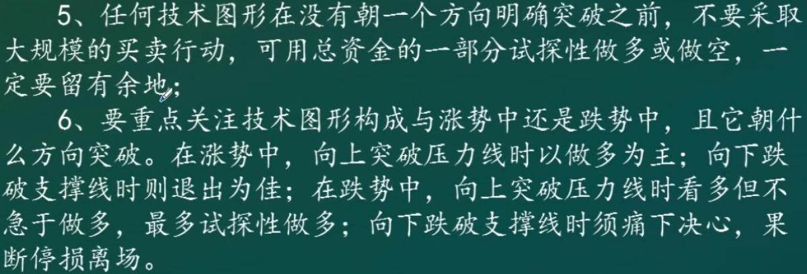
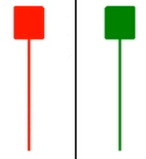
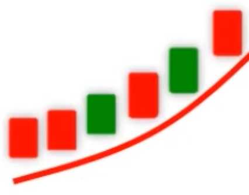
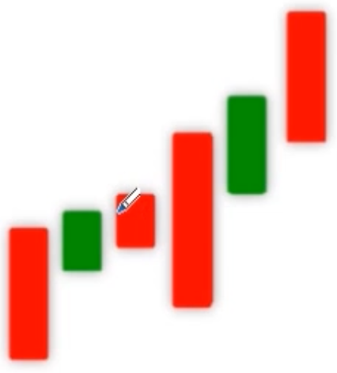
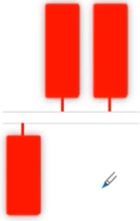
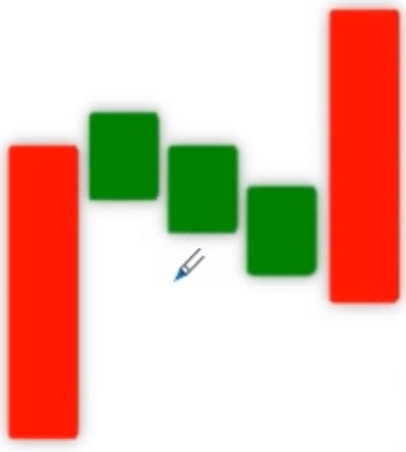
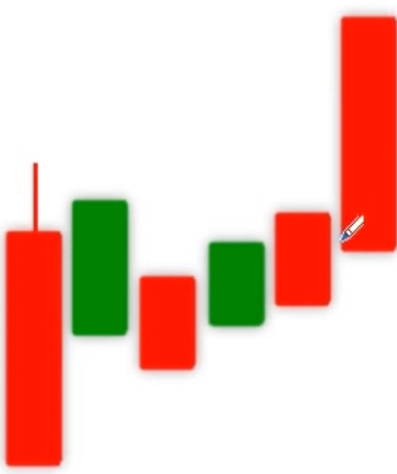
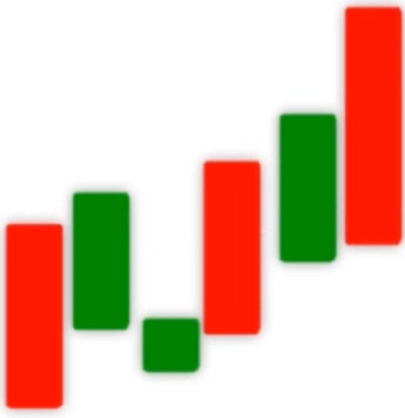

# K 线基础知识

## 技术分析

**技术分析**是指以市场行为为研究对象, 以判断市场趋势并跟随趋势的周期性变化来进行股票及一切金融衍生品交易决策方法的总和. 技术分析认为: 市场行为包含一切, 价格以趋势方式演变, 历史会重演

### 技术分析包括的内容

- K 线分析法
- 技术图形分析法
- 移动平均线分析法
- 波浪理论分析法
- 指标分析法

### 技术图形注意点

## 上升形态和见底形态

| 名称                             | 图形                                                         | 特征                                                         | 含义                                         | 备注                                                         |
| -------------------------------- | ------------------------------------------------------------ | ------------------------------------------------------------ | -------------------------------------------- | ------------------------------------------------------------ |
| 早晨十字星(希望十字星)           |  | 出现在下跌行情中                                             | 见底信号, 后市看涨                           |                                                              |
| 早晨之星(希望之星)               |  | 出现在下跌行情中                                             | 见底信号, 后市看涨                           | 信号不如早晨十字星强                                         |
| 好友反攻                         |  | 出现在下跌行情中. 由一阴一阳 2 根 K 线组成, 第 2 根 K 线跳空低开, 收盘时为一根中阳线或大阳线, 且收盘价与前一根 K 线相同或相近 | 见底信号, 后市看涨                           | 转势信号不如曙光初现强                                       |
| 曙光实现                         |  | 出现在下跌行情中. 由一阴一阳 2 根 K 线组成, 第 2 根 K 线实体深入到阴线实体的一半以上处 | 见底信号, 后市看涨                           | 阳线实体深入阴线实体的部分越多, 转势信号越强                 |
| 旭日东升                         |  | 出现在下跌趋势中                                             | 见底信号, 后市看涨                           | 见底信号, 强于曙光初现. 阳线实体调出阴线实体的部分越多, 转势信号越强 |
| 倒锤头线                         |  | 出现在下跌途中, 上影线大于等于实体的两倍                     | 见底信号, 后市看涨                           | 实体与上影线比例越悬殊, 信号越有参考价值. 如果倒锤头与早晨之星同时出现, 见底信号就更加可靠 |
| 锤头线                           |  | 出现在下跌途中. 下影线大于等于实体的两倍                     | 见底信号, 后市看涨                           | 实体与下影线比例越悬殊, 越有参考价值. 如果锤头线与早晨之星同时出现, 见底信号就更加可靠 |
| 平底(钳子底)                     |  | 出现在下跌趋势中. 最低价处在同一水平位置                     | 见底信号, 后市看涨                           |                                                              |
| 塔形底                           |  | 出现在下跌趋势中                                             | 见底信号, 后市看涨                           | 相当于早晨之星                                               |
| 圆弧底                           |  | 出现在下跌趋势中                                             | 见底信号, 后市看涨                           |                                                              |
| 低位并排阳线                     |  | 出现在下跌趋势中. 第一根阳线跳空低开, 收盘时在前一根 K 线下方形成缺口, 第二根阳线与第一根阳线并肩而立 | 见底信号, 后市看涨                           | 相当于好友反攻                                               |
| 低档五阳线                       |  | 出现在下跌趋势中. 连续出现 5(也可能是 6, 7) 根阳线(多为小阳线) | 见底信号, 后市看涨                           |                                                              |
| 连续跳空三阴线                   |  | 出现在下跌趋势中. 连续出现 3 根向下跳空低开的阴线            | 见底信号, 后市看涨                           | 如在股价已有大幅下挫的情况下出现, 见底的可能性大             |
| 跳空下跌三颗星                   |  | 出现在下跌趋势中. 3 根小阴线与上面一根 K 线有一个明显的缺口  | 见底信号                                     | 如果在 3 根小阴线后出现一根大阳线, 上涨的可能性更大          |
| 红三兵                           |  | 出现在上涨行情初期                                           | 买进信号, 后市看涨                           | 当 3 根小阳线收于最高或接近最高价时, 称为 3 个白色武士, 其拉升股价的作用要强于普通的红三兵 |
| 冉冉上升形                       |  | 在盘整的后期出现, 由若干根小 K 线组成(一般不少于 8 根), 其中以小阳线居多, 中间也可夹着小阴线或十字线. 整个 K 线排列成略微向上倾斜状 | 买进信号, 后市看涨                           | 升幅虽不大, 但往往是股价大幅上涨的前兆, 如成交量能同步放大, 这种可能性就很大 |
| 徐缓上升形                       |  | 多数出现在涨势初期                                           | 买进信号, 后市看涨                           | 相当于旭日东升                                               |
| 上升抵抗形                       |  | 在上涨途中出现. 连续跳空开盘, 即使中间收出阴线, 但收盘价也要比前一根 K 线的收盘价高 | 买进信号, 后市看涨                           |                                                              |
| 弧形线                           |  | 在涨势初期出现                                               | 买进信号, 后市看涨                           | 一旦弧形线被市场认可, 上涨周期就很长                         |
| 下控上涨形                       |  | 在上涨途中突然跳低开盘(甚至跌停板开盘), 当日以涨势收盘, 并收出一根大阳线(甚至以涨停板收盘) | 买进信号, 后市看涨                           | 多数为控盘庄家利用消息洗盘, 一般后市将有一段较大升势         |
| 两红夹一黑                       |  | 即可出现在涨势中, 也可出现在跌势中                           | 在涨势中出现继续看涨, 在跌势中出现是见底信号 |                                                              |
| 上涨两颗星                       |  | 在涨势初期, 中期出现, 第 2/3 根 K 线可以是小十字线/小阳线/小阴线 | 继续看涨                                     | 少数情况下会出现 3 根小 K 线, 这时称为上涨三颗星             |
| 跳空上扬形(升势鹤鸦缺口)         |  | 出现在涨势中, 收盘时留下一个缺口, 阴线收盘时在前一根阳线缺口上方附近 | 继续看涨                                     |                                                              |
| 高位并排阳线(升势恋人肩并肩缺口) |  | 出现在涨势中, 第二根阳线与第三根阳线的开盘价基本相同         | 继续看涨                                     | 这个缺口对后续股价走势有较强的支撑作用, 但如果发现股价跌破这个缺口, 股价走势就会较弱 |
| 上升三部曲(升势三鸦)             |  | 出现在上涨途中, 三根小阴线都没有跌破前面阳线的开盘价, 走势类似 "N" 字 | 继续看涨                                     |                                                              |
| 多方尖兵                         |  | 出现在上涨行情中, 第一根阳线留下一根较长的上影线, 接着股价回落, 但不久又涨至上影线的上方 | 继续看涨                                     | 实际上是多方进行的一次试盘                                   |
| 稳步上涨形                       |  | 出现在上涨行情中, 众多阳线中夹着较少的小阴线, 整个K线排列呈向上倾斜状 | 买进信号, 后市看涨                           | 后面的阳线对插入的阴线覆盖的速度越快越有力, 上升潜力就越大   |

## 下跌形态和滞涨形态

| 名称                 | 图形                                                         | 特征                                                         | 含义                                             | 备注                                                         |
| -------------------- | ------------------------------------------------------------ | ------------------------------------------------------------ | ------------------------------------------------ | ------------------------------------------------------------ |
| 黄昏十字星           |  | 出现在涨势途中, 第三根 K 线实体深入到第一根 K 线实体之内     | 见顶信号, 后市看跌                               |                                                              |
| 黄昏之星             |  | 出现在涨势途中                                               | 见顶信号, 后市看跌                               | 信号不如黄昏十字星                                           |
| 淡友反攻             |  | 出现在涨势中, 跳空开盘, 但收盘时为一根中阴线或大阴线, 且收盘价与前一根 K 线的收盘价相同或相近 | 见顶信号, 后市看跌                               | 转势信号不如乌云盖顶                                         |
| 乌云盖顶             |  | 出现在涨势中, 阴线已深入到阳线实体的二分之一以下处           | 见顶信号, 后市看跌                               | 阴线深入阳线实体部分越多, 转势信号越强                       |
| 倾盆大雨             |  | 出现在上涨趋势中                                             | 见顶信号, 后市看跌                               | 见顶信号强于乌云盖顶, 阴线实体低于阳线实体部分越多, 转势信号越强 |
| 射击之星(扫帚星)     |  | 出现在上涨趋势中, K 线实体很小, 上影线大于等于实体的两倍, 一般无下影线 | 见顶信号, 后市看跌                               | 实体与上影线比例越悬殊, 信号越有参考价值. 如射击之星与黄昏之星同时出现, 见顶信号就更加可靠 |
| 吊颈线               |  | 出现在涨势中, 下影线大于等于实体的两倍, 一般无上影线         | 见顶信号, 后市看跌                               | 实体与下影线比例越悬殊, 越有参考价值, 如吊颈线与黄昏之星同时出现, 见顶信号就更加可靠 |
| 平顶(钳子顶)         |  | 出现在涨势中, 最高价处在同一水平位置上                       | 见顶信号, 后市看跌                               |                                                              |
| 塔形顶               |  | 出现在上涨趋势中                                             | 见顶信号, 后市看跌                               | 相当于黄昏之星                                               |
| 圆顶                 |  | 出现在上涨趋势中                                             | 见顶信号, 后市看跌                               | K 线的圆顶与技术图形的圆顶有一定区别                         |
| 双飞乌鸦             |  | 出现在上涨趋势中, 第一根阴线的收盘价高于前一根阳线的收盘价, 且第二根阴线完全包含了第一根阴线 | 见顶信号, 后市看跌                               |                                                              |
| 三只乌鸦(暴跌三杰)   |  | 出现在涨势中, 阴线多为大阴线或中阴线, 每次均以跳高开盘, 最后以下跌收盘 | 见顶信号, 后市看跌                               |                                                              |
| 高档五阴线           |  | 出现在涨势中, 阴线多为大阴线或中阴线, 每次均以跳高开盘, 最后以下跌收盘 | 见顶信号, 后市看跌                               | 高档五阴线不一定都是 5 根阴线, 有时可能是 6/7 根             |
| 下降覆盖线           |  | 在上涨行情中出现, 前 2 根 K 线构成一个穿头破脚形态, 第三根 K 线是一根中阳线或小阳线, 但阳线实体通常比前一根阴线要短, 之后是一根中阴线或小阴线, 阴线实体已深入到前一根阳线实体中 | 见顶信号, 后市看跌                               | 见顶信号要强于穿头破脚                                       |
| 低档盘旋形           |  | 出现在下跌途中                                               | 卖出信号, 后市看跌                               |                                                              |
| 黑三兵               |  | 即可在涨势中出现, 也可在跌势中出现                           | 卖出信号, 后市看跌                               |                                                              |
| 下跌不止形           |  | 出现在下跌途中, 整个 K 线排列呈向下倾斜状                    | 卖出信号, 后市看跌                               |                                                              |
| 阳线跛脚形           |  | 出现在涨势中, 最后 2 根阳线都是低开, 且最后 1 根阳线收盘价比前面阳线收盘价要低 | 滞涨信号, 后市看淡                               |                                                              |
| 倒三阳               |  | 出现在下跌初期, 每日都是低开高走, 后 2 根 K 线收盘价都低于或接近前一天的阳线开盘价, 图形上类似连续 3 根阴线的跌势 | 卖出信号, 后市看跌                               | 多数发生在庄家股上, 下跌概率极大                             |
| 徐缓下跌形           |  | 多数出现在跌势初期                                           | 卖出信号, 后市看跌                               |                                                              |
| 下降抵抗形           |  | 出现在下跌途中, 连续跳低开盘, 即使中间出现阳线, 但收盘价也要比前一根 K 线的收盘价低 | 卖出信号, 后市看跌                               |                                                              |
| 高开出逃形           |  | 突然跳高开盘, 甚至以涨停开盘, 最后收盘为一根大阴线(甚至以跌停板收盘) | 卖出信号, 后市看跌                               | 多数为被套庄家利用朦胧消息拉高出货所致, 一般后市将在一段较大跌势 |
| 绵绵阴跌形           |  | 在盘整后期出现, 由若干根小 K 线组成(一般不少于8根), 其中以小阴线居多, 整个 K 线排列呈略微向下倾斜状 | 卖出信号, 后市看跌                               |                                                              |
| 下跌三颗星           |  | 在下跌行情初期, 中期出现                                     | 卖出信号, 后市看跌                               | 表明市场买卖意愿不强, 市场将以盘整下跌为主                   |
| 下降三部曲(降势三鹤) |  | 出现在下跌趋势中                                             | 卖出信号, 后市看跌                               |                                                              |
| 空方尖兵             |  | 出现在下跌行情中, 收盘时留下一根较长的下影线, 然后股价反弹, 但不久股价又跌至下影线下方 | 卖出信号, 后市看跌                               | 走势出现这种形态, 为空方主力的一次试盘                       |
| 连续跳空三阳线       |  | 出现在上涨行情中, 连续出现 3 根向上跳空高开的阳线            | 滞涨信号, 后市看淡                               |                                                              |
| 升势受阻             |  | 出现在涨势中, 3 根阳线实体越来越小, 最后一根阳线的上影线很长 | 滞涨信号, 后市看淡                               |                                                              |
| 升势停顿             |  | 出现在涨势中, 第三根阳线实体很小, 反映上升的势头可能停顿     | 滞涨信号, 后市看淡                               |                                                              |
| 两黑夹一红           |  | 即可出现在涨势中, 也可出现在跌势中                           | 在涨势中出现, 是见顶信号, 在跌势中出现, 继续看跌 |                                                              |

## 即是上升形态又是下跌形态

| 名称       | 图形                                                         | 特征                                                         | 含义                                                         | 备注                                                         |
| ---------- | ------------------------------------------------------------ | ------------------------------------------------------------ | ------------------------------------------------------------ | ------------------------------------------------------------ |
| 大阳线     |  | 阳线实体较长, 可略带上/下影线                                | 1. 在上涨刚开始时, 出现大阳线, 后市看涨 2. 在上涨途中出现大阳线时, 继续看涨 3. 在连续加速上涨行情中出现大阳线, 是见顶信号 4. 在连续下跌的行情中出现大阳线, 有见底回升的意义 | 阳线实体越长, 信号越可靠                                     |
| 小阳线     |  | 在盘整行情中出现较多, 也可以在上涨和下跌行情中出现, 阳线实体较小, 可略带上/下影线 | 说明行情不明朗, 多空双方小心接触, 但多方略占上风             |                                                              |
| 大阴线     |  | 可出现在任何情况下                                           | 1. 在涨势中出现, 是见顶信号 2. 在下跌初期出现, 后市看跌 3. 在下跌途中出现, 继续看跌 4. 在连续下跌行情中出现, 有空头陷阱之嫌疑 |                                                              |
| 小阴线     |  | 在盘整行情中出现较多, 也可在上涨和下跌行情中出现             | 说明行情不明朗, 多空双方小心接触, 但空方略占优势             |                                                              |
| 十字线     |  | 即可出现在涨势中, 也可出现在跌势中                           | 1. 在上涨趋势末期出现, 是见顶信号 2. 在下跌趋势末期出现, 是见底信号 3. 在上涨途中出现, 继续看涨 4. 在下跌途中出现, 继续看跌 | 信号可靠性不强, 应结合其它 K 线一起研判                      |
| 长十字线   |  | 即可出现在涨势中, 也可出现在跌势中                           | 1. 在上涨趋势末期出现, 是见顶信号 2. 在下跌趋势末期出现, 是见底信号 3. 在上涨途中出现, 继续看涨 4. 在下跌途中出现, 继续看跌 | 比一般十字线信号要可靠                                       |
| 螺旋桨     |  | 即可出现在涨势中, 也可出现在跌势中                           | 1. 在涨势中出现, 后市看跌 2. 在下跌途中出现, 继续看跌 3. 在连续加速下跌行情中出现, 有见底回升的意义 | 转势信号比长十字线更强                                       |
| 一字线     |  | 即可出现在涨势中, 也可出现在跌势中, 开盘/收盘/最高/最低价几乎相同 | 1. 在上涨趋势中出现, 是买进信号 2. 在下跌趋势中出现, 是卖出信号 | 在涨跌停板制度下, 一字线有特别意义 1. 涨势中出现一字线, 表示股价封在涨停价上, 说明多头气盛, 日后该股往往会变成强势股 2. 跌势中出现一字线, 表示股价封杀在跌停价上, 说明空头力量极强, 日后该股往往会变成弱势股 |
| T 字线     |  | 开盘价/收盘价/最高价相同, 但最低价与之有相当的距离           | 1. 在上涨趋势末端出现, 为卖出信号 2. 在下跌趋势末端出现, 为买进信号 3. 在上涨途中出现, 继续看涨 4. 在下跌途中出现, 继续看跌 | T 字线下影线越长, 信号越可靠                                 |
| 倒 T 字线  |  | 开盘价/收盘价/最低价相同, 但最高价与之有相当的距离           | 1. 在上涨趋势末端出现, 为卖出信号 2. 在下跌趋势末端出现, 为买进信号 3. 在上涨途中出现, 继续看涨 4. 在下跌途中出现, 继续看跌 | 倒 T 字线上影线越长, 信号越可靠, 在上升趋势中出现倒 T 字线, 称为上档倒 T 字线, 又称下跌转折线 |
| 搓揉线     |  | 多数出现在涨势中, 由一正一反两根 T 线组成                    | 1. 在上涨途中出现, 继续看涨 2. 在上涨末端出现, 是见顶信号 | 在上涨途中出现以小 T 字线居多, 在上涨末端出现以大 T 字线居多 |
| 尽头线     |  | 即可出现在涨势中, 也可出现在跌势中, 第二根 K 线为小十字(或小阴线, 小阳线), 依附在第一根 K 线的上影线或下影线之内 | 1. 出现在涨势中, 是见顶信号 2. 出现在跌势中, 是见底信号   | 尽头线的上影线或下影线的右方, 带着的 K 线越小, 信号越强      |
| 身怀六甲   |  | 即可出现在涨势中, 也可出现在跌势中, 第一根 K 线实体完全包含第二根 K 线实体 | 1. 出现在涨势中, 是卖出信号 2. 出现在跌势中, 是买进信号  | 若第二根 K 线为十字线, 称为十字胎, 是转势力度最大的 K 线形态之一 |
| 穿头破脚   |  | 即可出现在涨势中, 也可出现在跌势中, 后者将前者实体完全包容在内, 在上涨趋势中, 前一根为阳线, 在下跌趋势中, 前一根为阴线 | 1. 出现在涨势中, 是卖出信号 2. 出现在跌势中, 是买进信号  | 两根 K 线长短越悬殊, 或一根长的 K 线包容前面的 K 线越多, 信号就越有参考价值 |
| 镊子线     |  | 即可出现在涨势中, 也可出现在跌势中, 上涨时, 3 根 K 线实体的最高价相同, 下跌时最低价相同 | 1. 出现在涨势中, 是头部信号 2. 出现在跌势中, 是底部信号  |                                                              |
| 上档盘旋形 |  | 出现在上涨途中                                               | 上涨盘旋时间在 5~14 天内, 超过 14 天多数看跌                 | 盘旋时间太久, 说明多方上攻愿意不强, 因而跌的可能性很大       |
| 加速度线   |  | 即可出现在涨势中, 也可出现在跌势中                           | 1. 出现在涨势中, 是头部信号 2. 出现在跌势中, 是底部信号  |                                                              |
| 下跌三连阴 |  | 出现在跌势中, 每根阴线都以最低价或次低价收盘, 最后一根阴线往往是大阴线 | 1. 在下跌初期出现, 继续看跌 2. 在下跌后期出现, 是见底信号 | 在连续阴跌不止的情况下, 特别是在股价已有较大跌幅后出现三连阴, 表明空方力量已用尽 |

