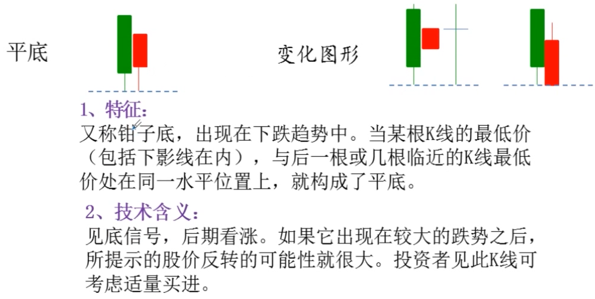
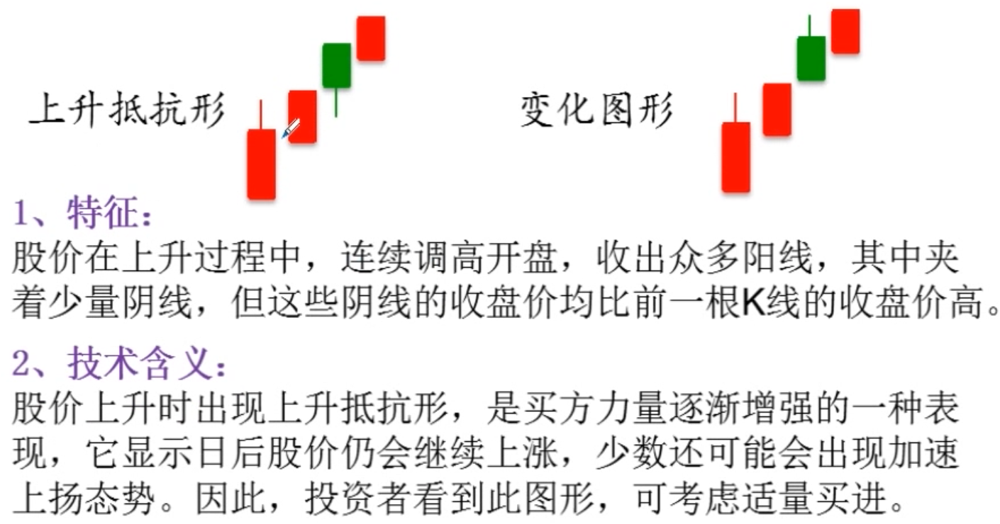

# K 线组合

## 大阳线

## 大阴线

## 锤头线

## 吊颈线

## 倒锤头线

## 射击之星

## T 字线

## 倒 T 字线

## 一字线

## 长十字线

## 螺旋桨线

## 曙光初现

## 乌云盖顶

## 旭日东升

## 倾盆大雨

## 早晨十字星

## 黄昏十字星

## 早晨之星

## 黄昏之星

## 身怀六甲

## 穿头破脚

## 平底

## 平顶

## 圆底

## 圆顶

## 塔形底

## 塔形顶

## 红三兵

## 黑三兵

## 三个白色武士

## 升势停顿

## 升势受阻

## 冉冉上升形

## 绵绵阴跌形

## 徐缓上升形

## 徐缓下降形

## 上升抵抗形

## 下降抵抗形

## 稳步上涨形

## 下跌不止形

## 高位并排阳线

## 低位并排阳线

## 上档盘旋形

## 低档盘旋形

## 上升三部曲

## 下降三部曲

## 两红夹一黑

## 两黑夹一红

## 多方尖兵

## 空方尖兵

## 好友反攻

## 淡友反攻

## 上涨两颗星

## 下跌三颗星

## 连续跳空三阳线

## 连续跳空三阴线

## 跳空上杨形

## 下档五阳线

## 高开出逃形

## 下探上涨形

## 双飞乌鸦

## 三只乌鸦

## 下跌三连阴

## 下降覆盖线

## 阳线跛脚形

## 倒三阳

## 加速度线

## 弧形线

## 镊子线

## 尽头线

## 搓揉线

