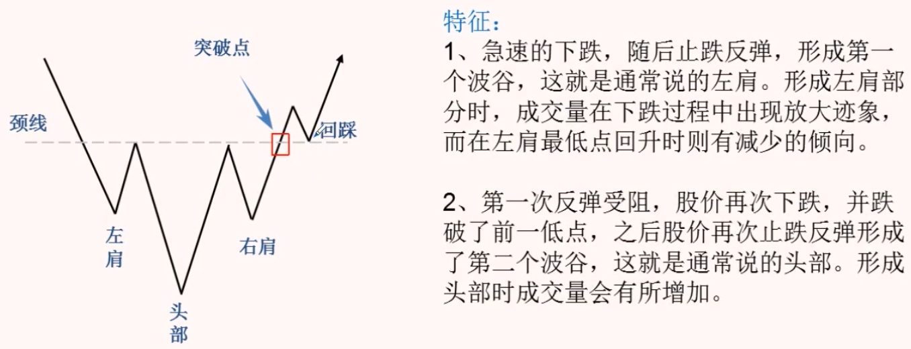
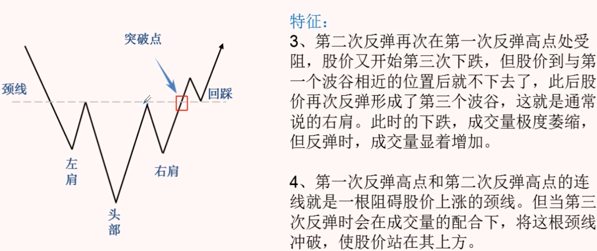

# K 线技术图形

## 转势形态

### 头肩底

### 头肩顶

### 双底

### 双顶

### 圆底

### 圆顶

## 整理形态

### 上升三角形

### 下降三角形

### 底部三角形

#### 底部三角形和下降三角形的区别

### 扩散三角形

### 收敛三角形

### 上升楔形

### 下降楔形

### V形

### 倒置V形

### 向上跳空缺口

### 向下跳空缺口

### 底部岛形反转

### 顶部岛形反转

### 矩形

### 潜伏底

