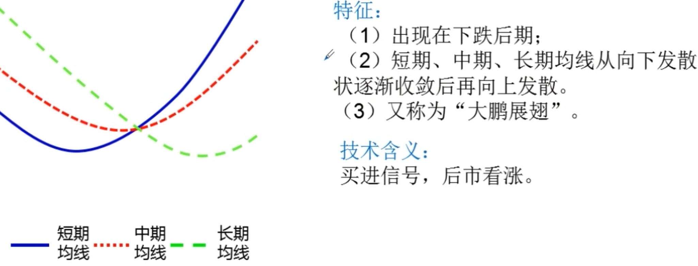
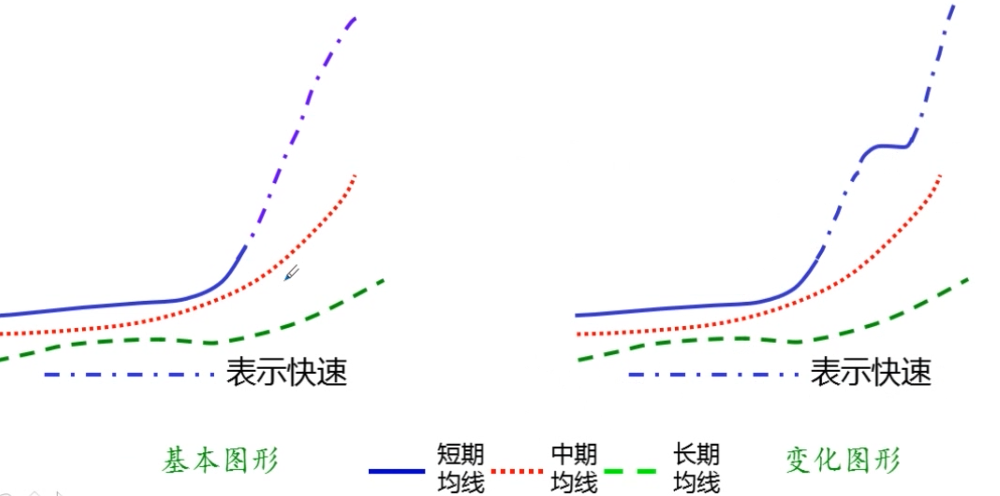
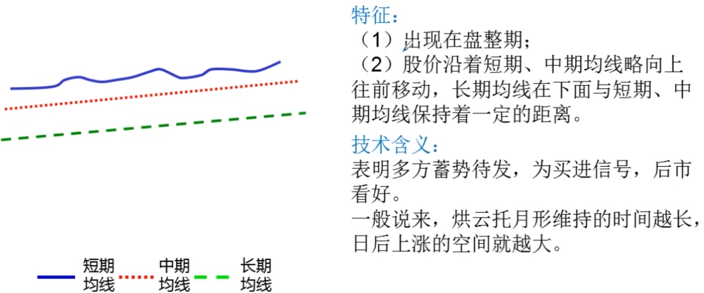

# 移动平均线

## 种类

### 单根平均线

- 短期平均线
  - 3日
  - 5日
  - 10日
- 中期平均线
  - 20日
  - 30日
  - 60日
- 长期平均线
  - 120日(半年线)
  - 250日(年线)

### 普通组合移动平均线

- 短期均线组合: 5日, 10日, 20日
  - 5日均线为多方护盘中枢, 不然则上升力度有限
  - 10日均线为多头的重要支撑线, 一旦10日无线被有效击破, 市场可能转弱
  - 20日均线是衡量市场短, 中期趋势强弱的重要标志
    - 20日均线向上倾斜时, 可短期看多, 做多
    - 20日均线向下倾斜时, 可短期看空, 做空
- 中期均线组合: 20日, 40日, 60日
  - 中期均线组合呈多头排列状态(均线同时向上方倾斜)时, 说明大盘或个股中期趋势向好, 可中期看多, 做多
  - 中期无线组合呈空头排列状态时, 说明大盘或个股中期趋势向淡, 可中期看空, 做空
- 长期均线组合: 60日, 120日, 250日
  - 长期均线组合形成多头排列时, 说明市场对大盘或个股中长期趋势看好
  - 长期均线组合形成空头排列时, 说明市场对大盘或个股长期趋势看淡

### 特殊组合移动平均线

- 周均线
- 月均线
- 分时均线

- 周均线和月均线组合适用于对大盘或个股长期趋势研判
- 分时均线组合适宜观察大盘和个股更细微的瞬间变化

## 移动平均线的作用

### 提示股价运动方向

均线向下, 则趋势向淡, 均线向上, 则趋势向好

- 黄金交叉: 天数少的均线上穿天数多的均线, 且天数多的均线在向上移动
- 死亡交叉: 天数少的均线下穿天数多的均线, 且天数多的均线在向下移动

### 提示当前市场的平均成本

### 助涨助跌的作用

## 均线组合

### 多头排列

### 空头排列

### 黄金交叉

### 死亡交叉

### 银山谷

### 金山谷

### 死亡谷

### 首次粘合向上发散形

### 首次粘合向下发散形

### 首次交叉向上发散形

### 首次交叉向下发散形

### 再次粘合向上发散形

### 再次粘合向下发散形

### 再次交叉向上发散形

### 再次交叉向下发散形

### 上山爬坡形

### 下山滑坡形

### 逐浪上升形

### 逐浪下降形

### 加速上涨形

### 加速下跌形

### 快速上涨形

### 快速下跌形

### 烘云托月形

### 乌云密布形

### 蛟龙出海形

### 断头铡刀形

