# 移动平均线

## 真假黄金交叉

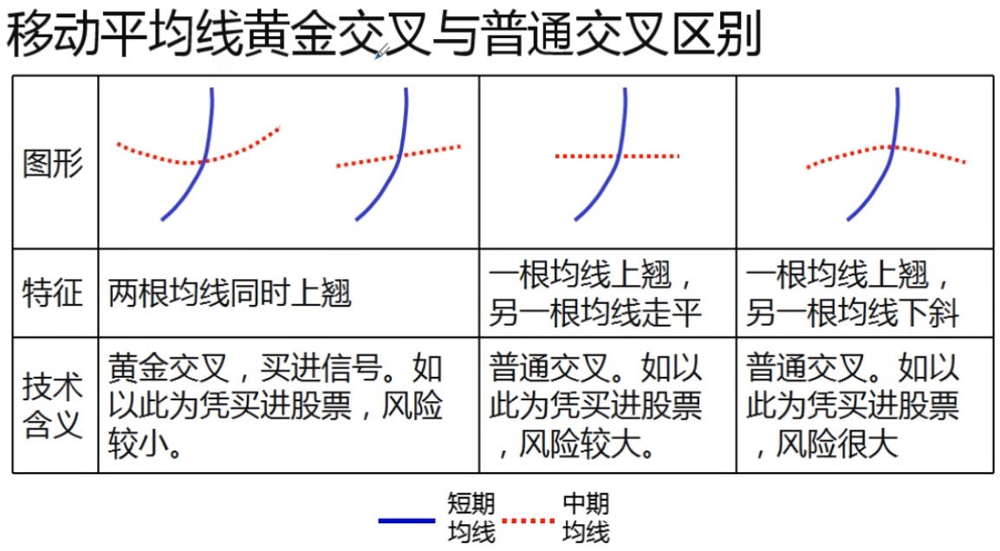

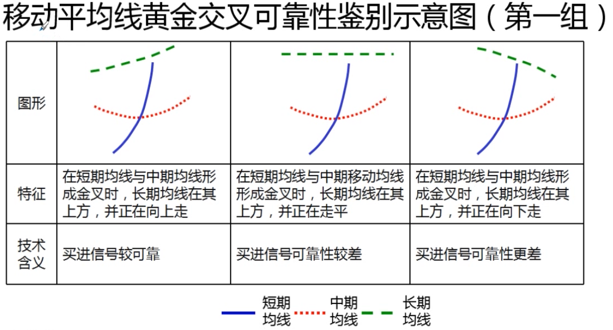

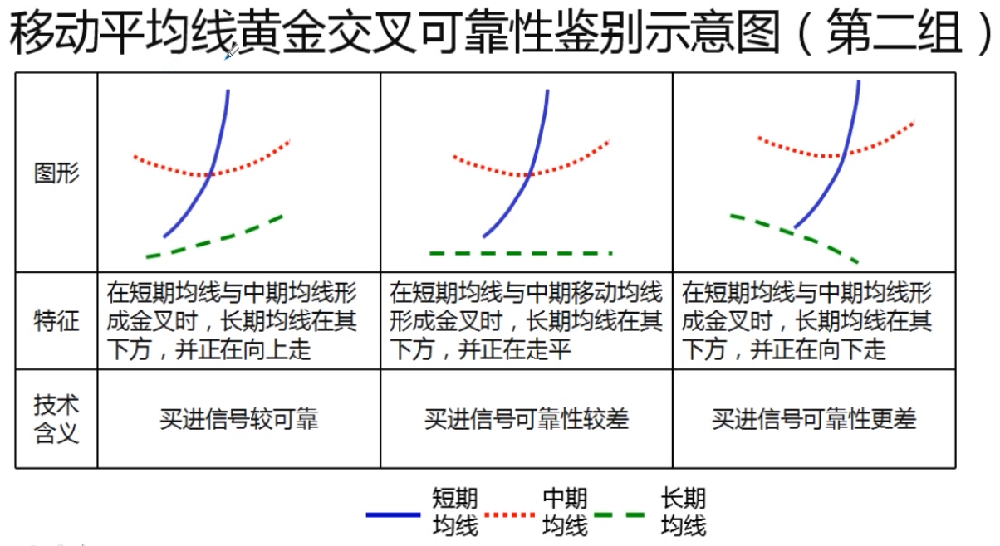

### 买进信号强弱

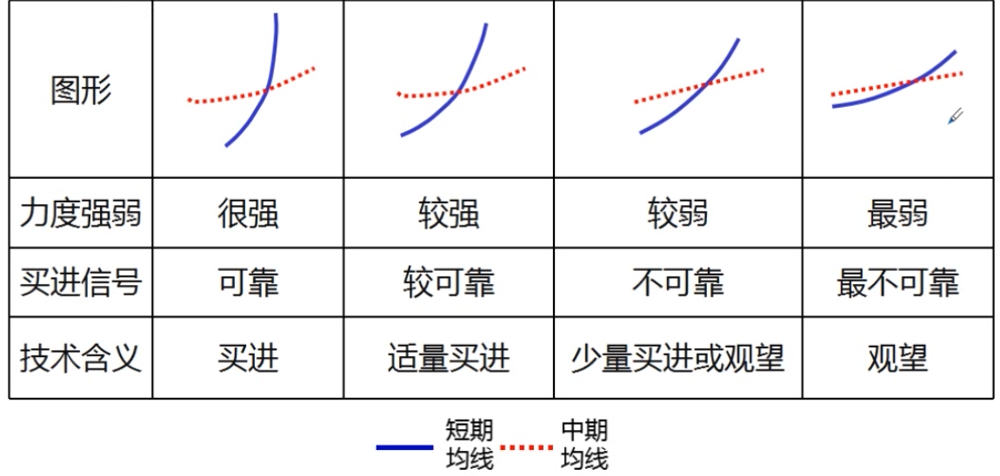

## 真假死亡交叉

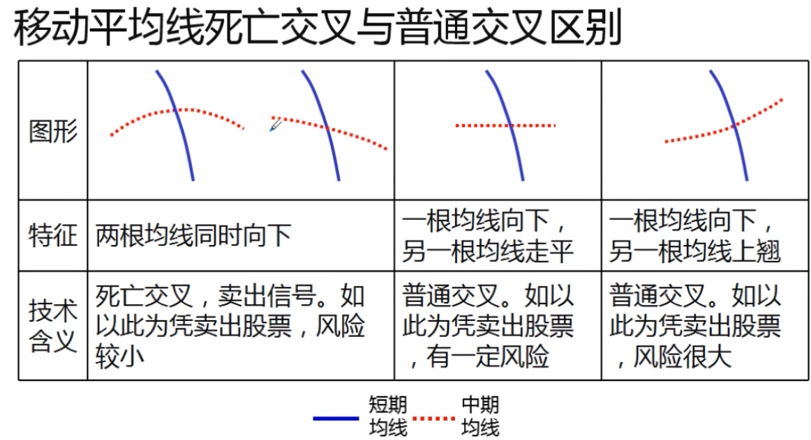

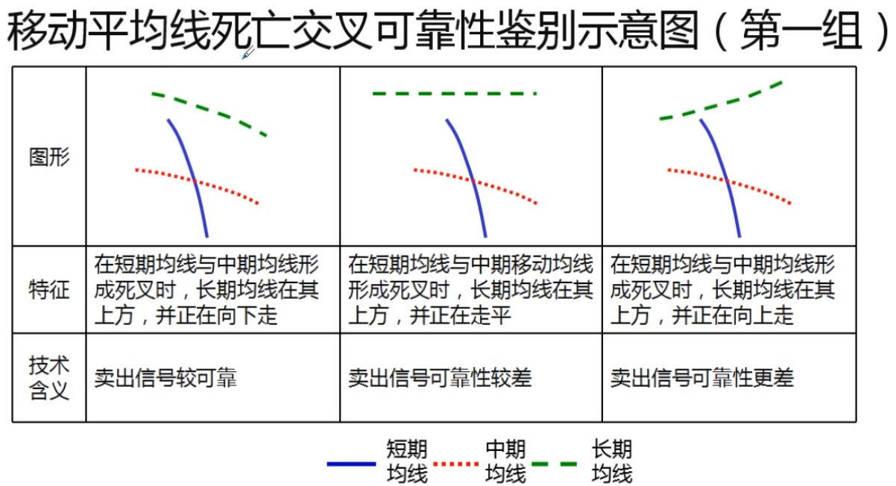

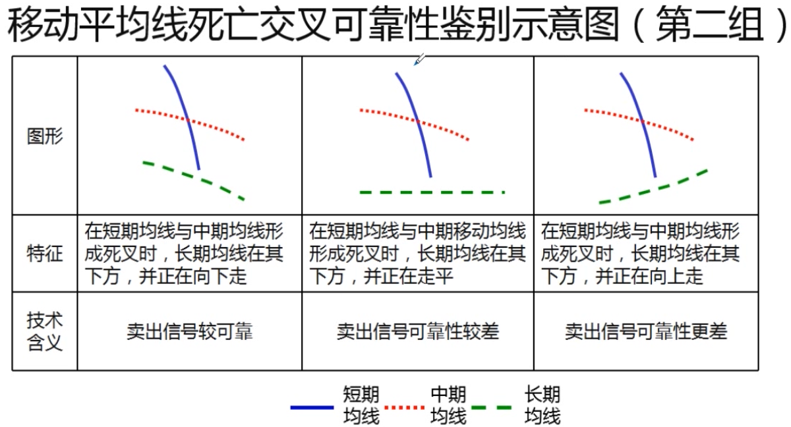

## 多头陷阱

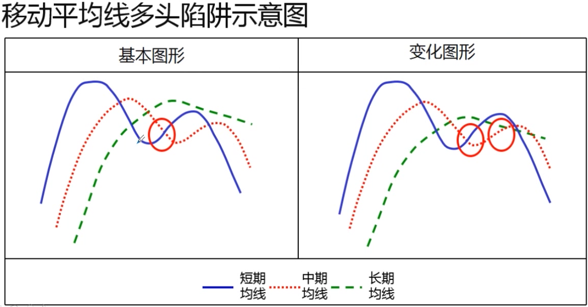

## 空头陷阱

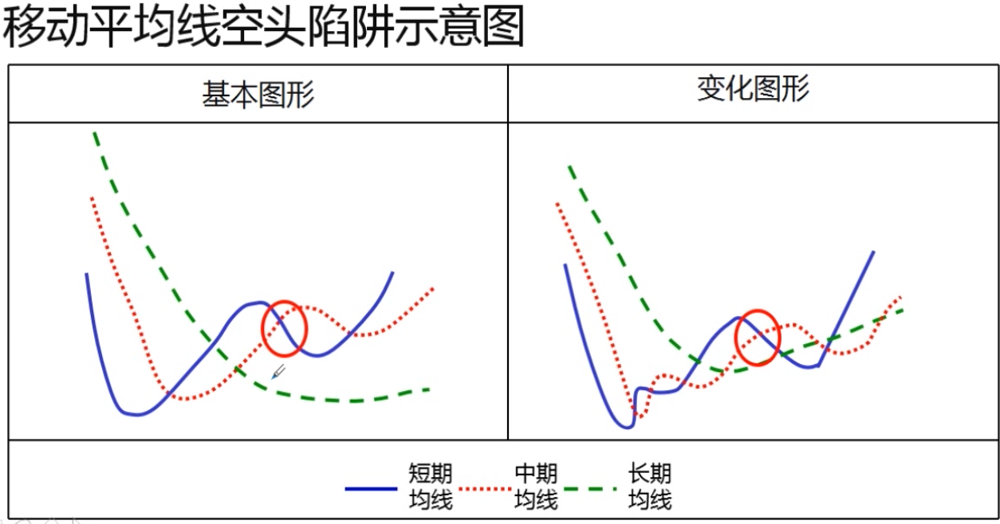

## 移动平均线高位转势信号

## 移动平均线向上发散后走势变化

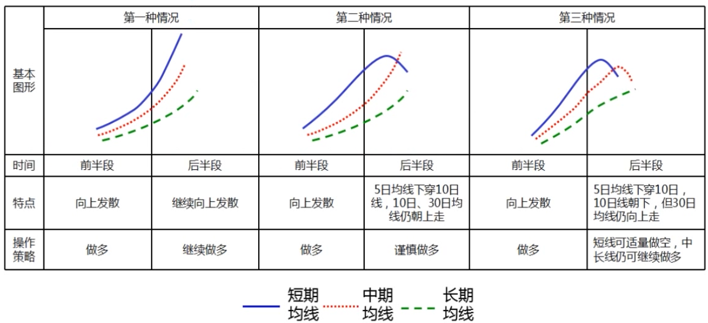

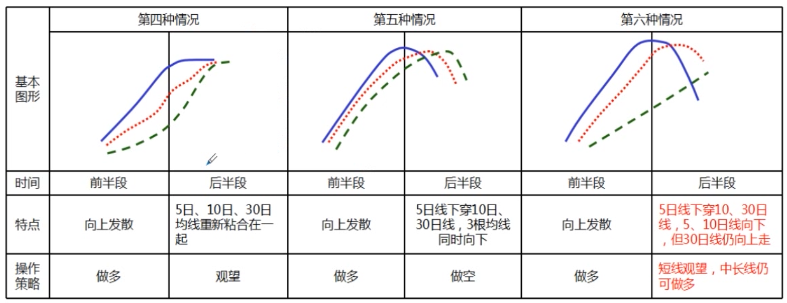

## 根据移动平均线之间差价研判股市中期走势

## 20, 30, 120 日均线

### 20 日均线

- 上升表示中短期趋势向上, 下行表示中短期趋势向下
- 行情在箱形运行时, 参考价值大大减少

### 30 日均线

- 30 日均线是市场的生命线, 是一个重要的参考指标

### 120 日均线(半年线, 长期)

- 股价有效跌破 120 日线后做空
- 股价在 120 日线以下持币观望
- 股价向上突破 120 日均线后做多
- 股价在 120 日线上方持股持涨

## 均线参数调整常见股票特征

- 前期缩量整理后, 成交量突然开始增加
- 平台整理越平越好
- 为当前热点, 最好是领头羊

## 总结

- 分清多头和空头排列
- 短期预测以 5/10 日均线为主
- 中期预测以 30/60 日均线为主
- 中长期走势以 120 日均线为主
- 长期走势以 250 日均线为主
- 建立自己的交易规则
- 全面了解均线的各种图形的特征和技术含义
- 重点关注成功概率高的均线图形
- 辩证地看待黄金交叉和死亡交叉
- 适时修改参数
- 与其它技术分析方法结合起来, 效果更好
