# 股票趋势线

- 趋势用来判断中长期走势
- 涨势形成不得不涨, 跌势形成不得不跌
- **跟着趋势走, 不要与趋势抗衡**

## 趋势线的分类

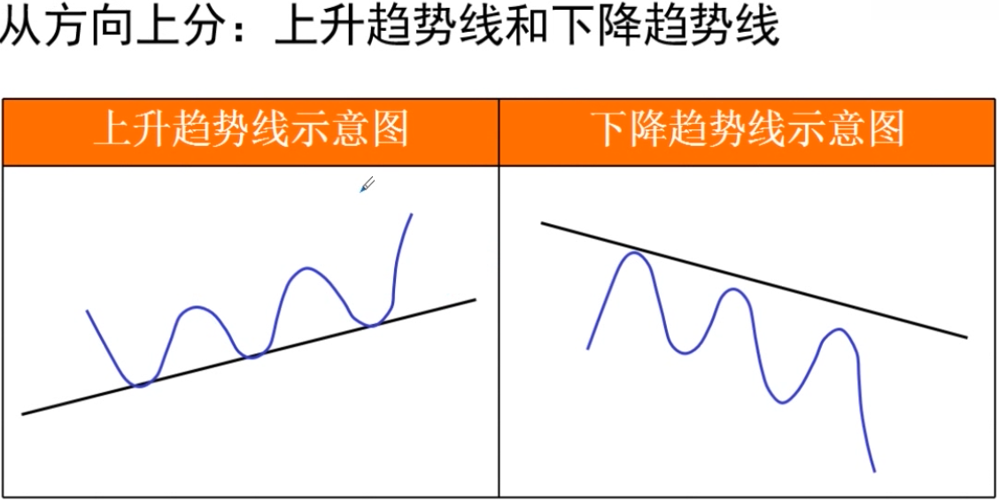

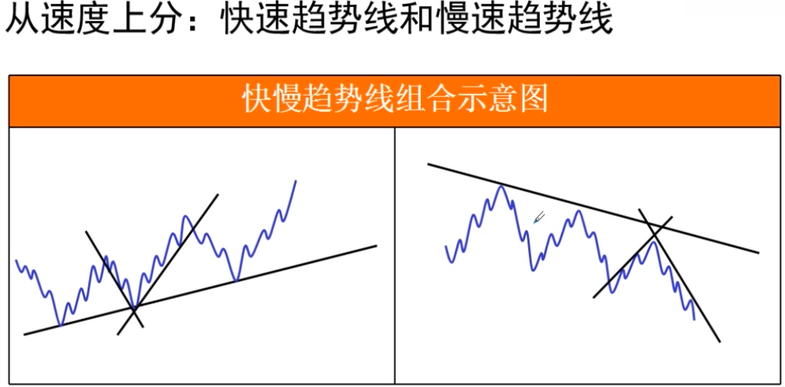

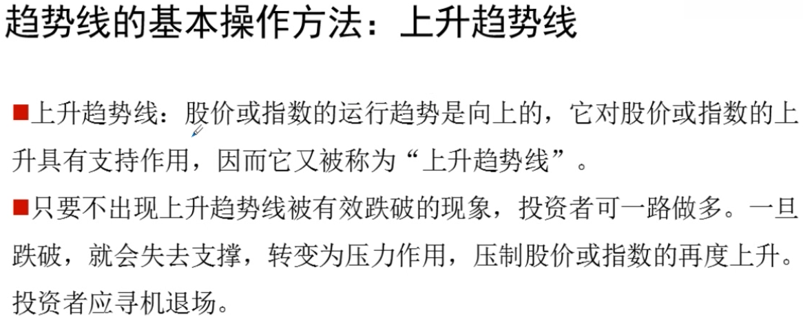

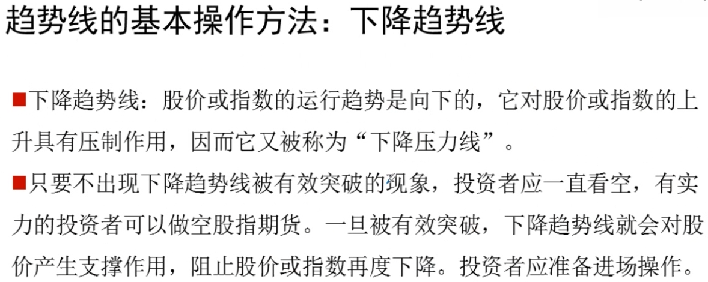

## 趋势线图形

### 上升趋势线

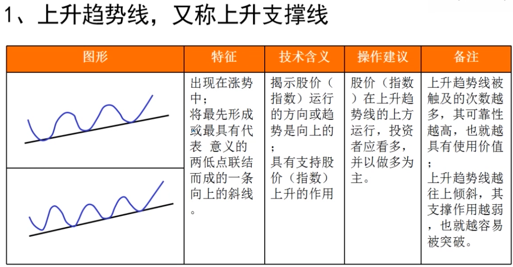

### 下降趋势线

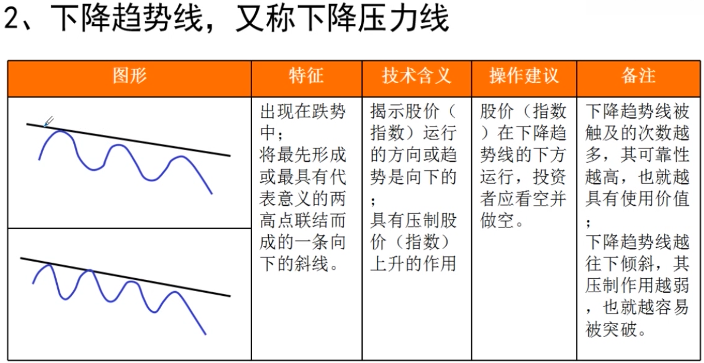

### 慢速上升趋势线

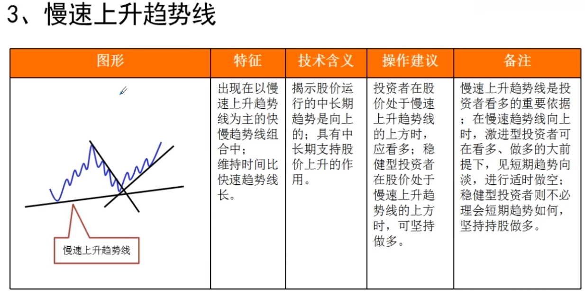

### 慢速下降趋势线

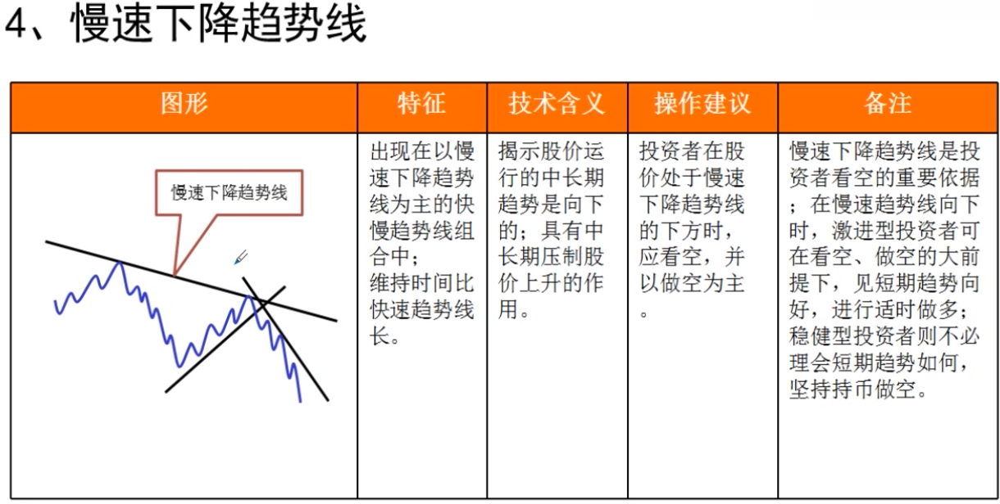

### 快速上升趋势线

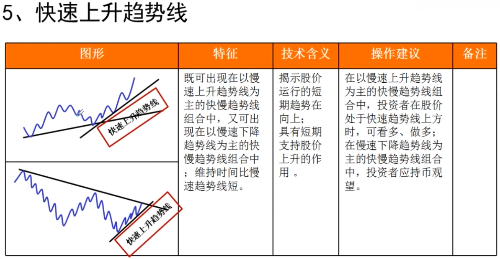

### 快速下降趋势线

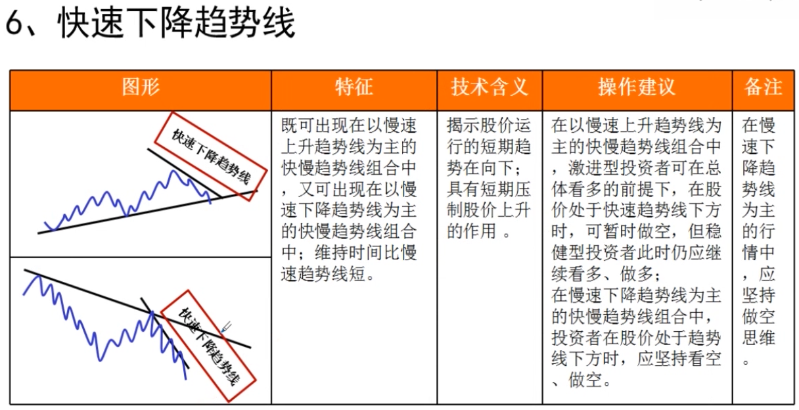

### 上升趋势线被有效突破

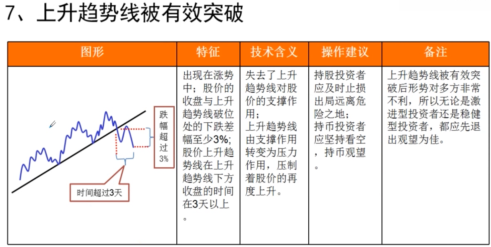

### 下降趋势线被有效突破

### 新的上升趋势线

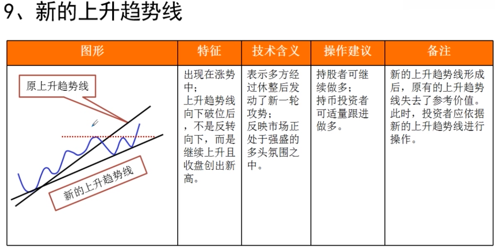

### 新的下降趋势线

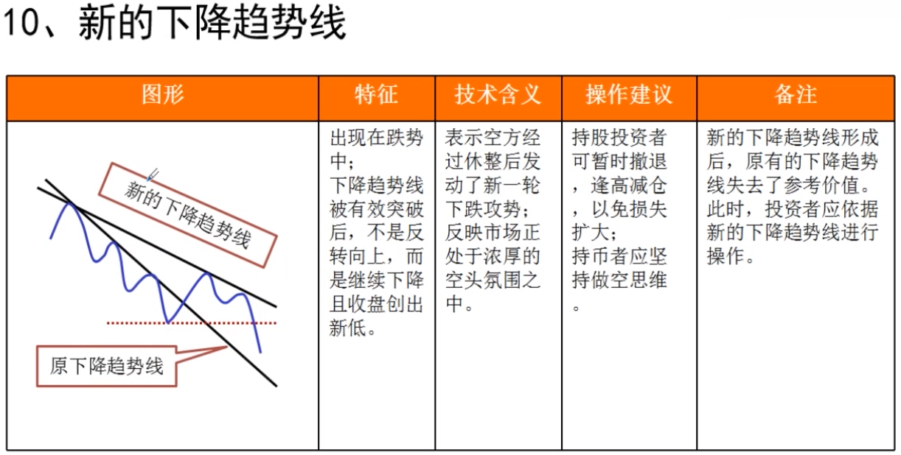

## 总结

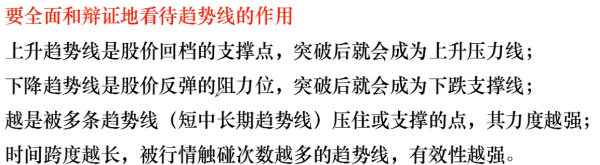

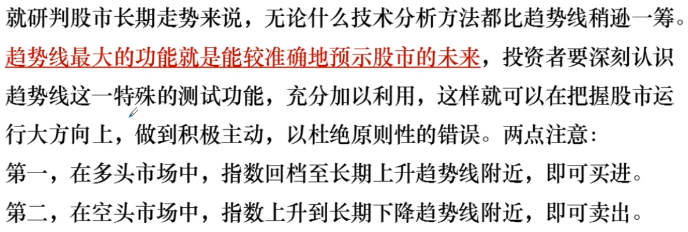

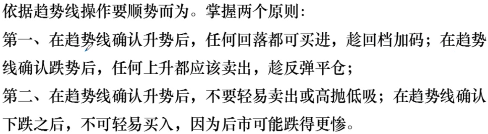

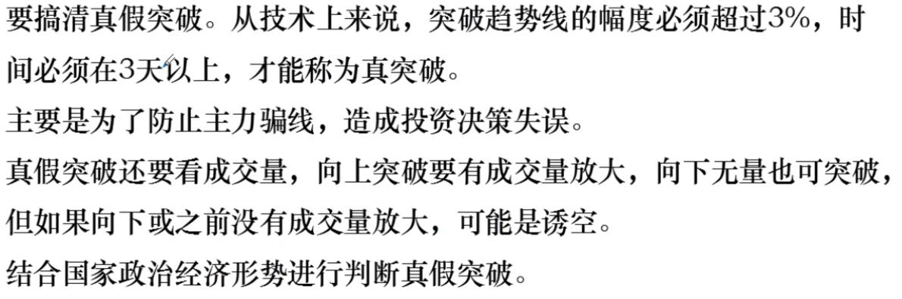

