# MACD

## 图像

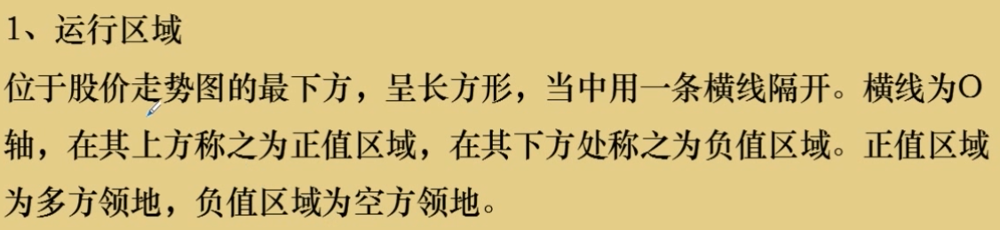

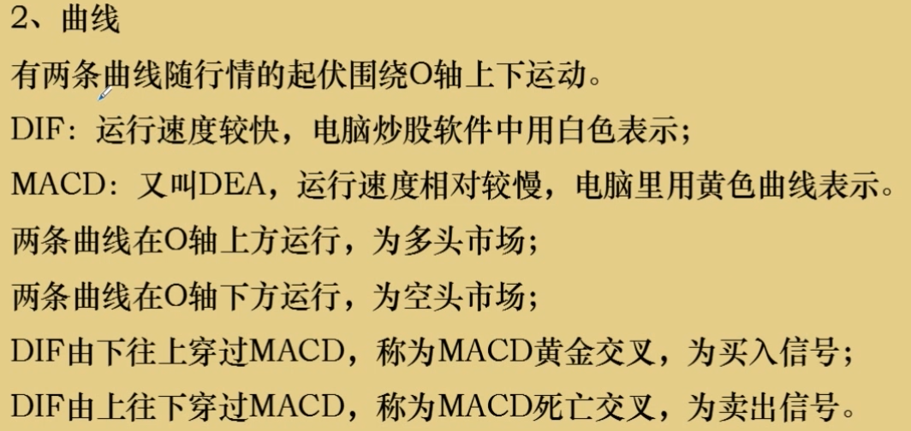

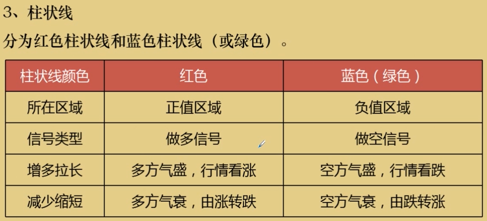

## MACD 图形

###  MACD 上穿 0 轴

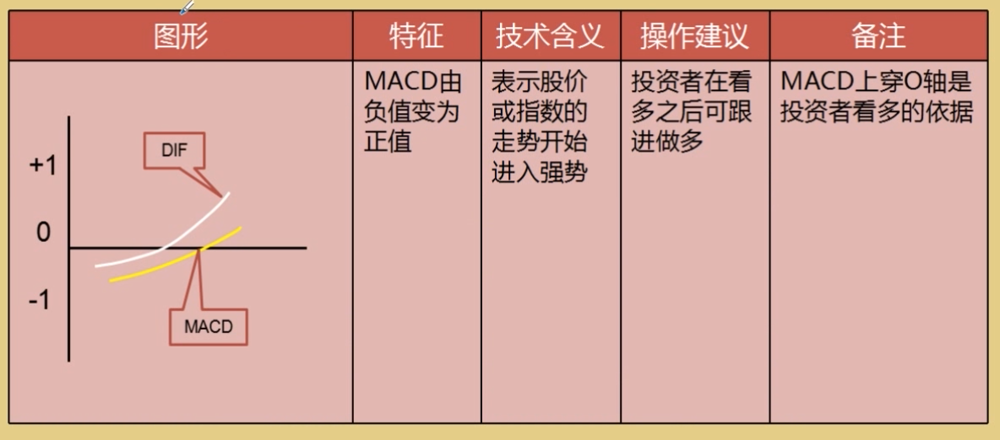

### MACD 下穿 0 轴

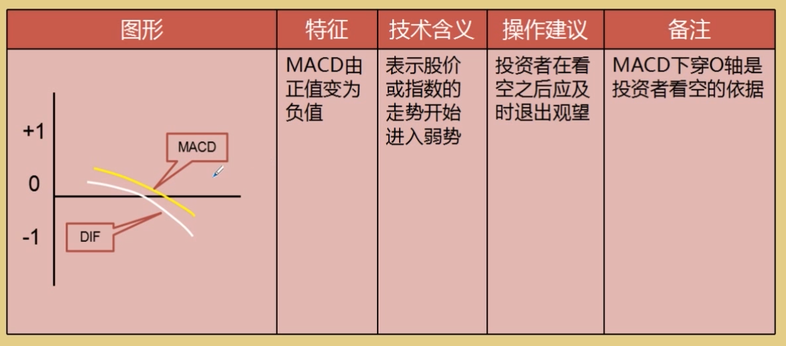

### MACD 调头向上(正值区域)

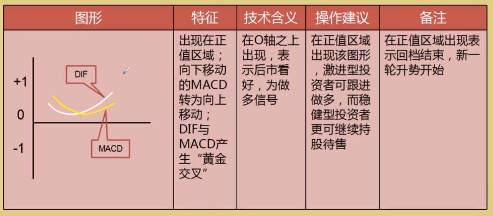

### MACD 调头向上(负值区域)

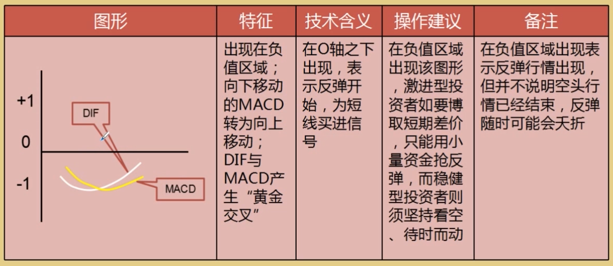

### MACD 调头向下(正值区域)

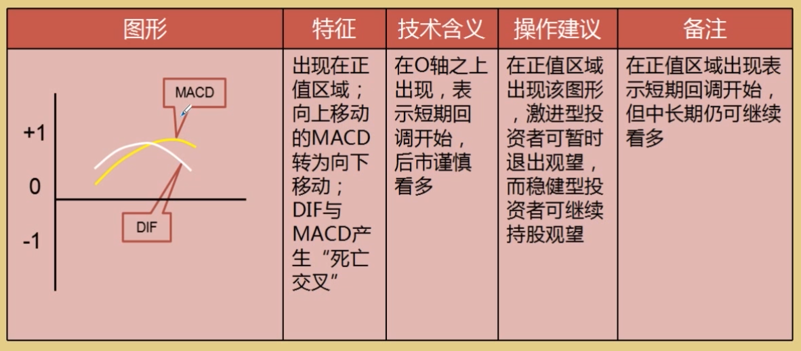

### MACD 调头向下(负值区域)

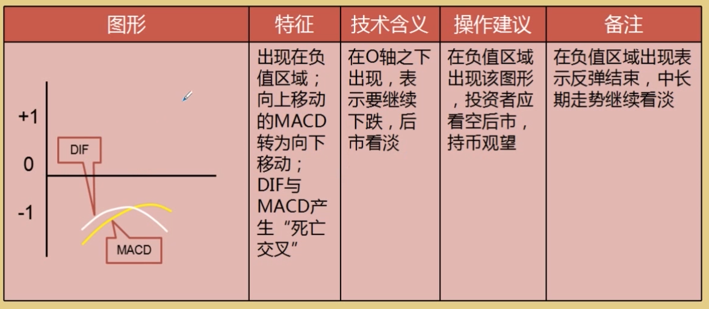

### MACD 与股价底背离

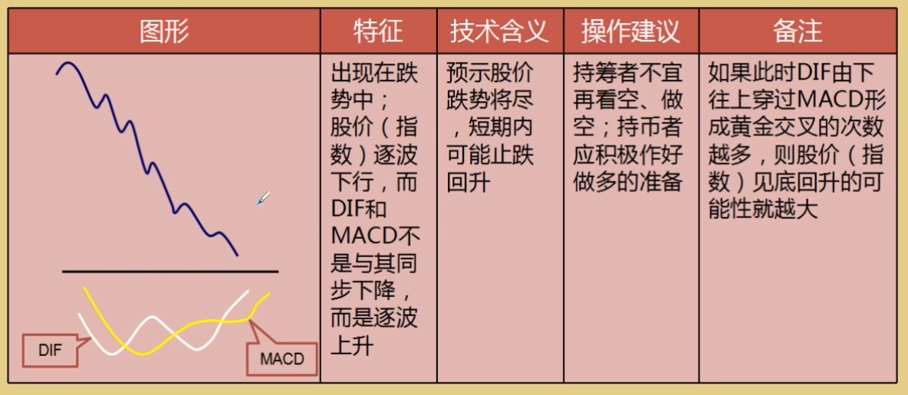

### MACD 与股价顶背离

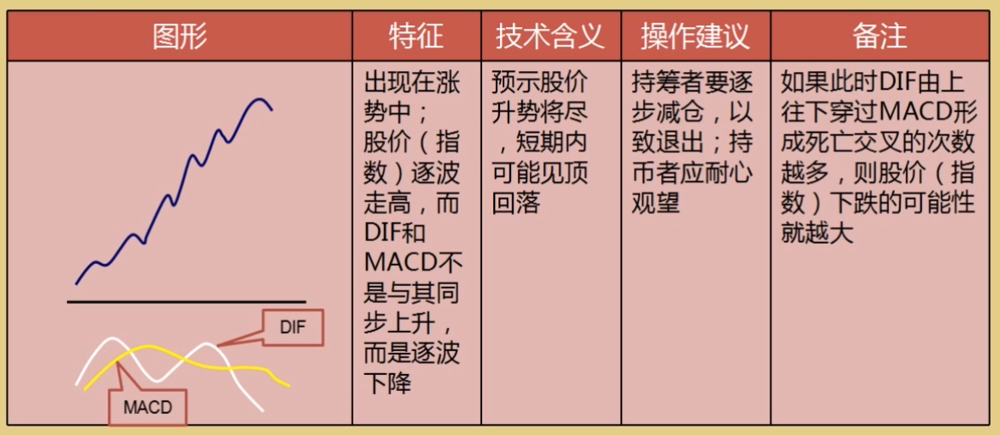

## 总结

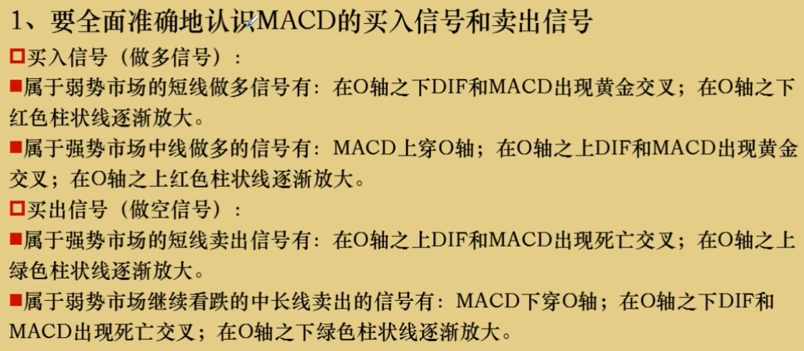

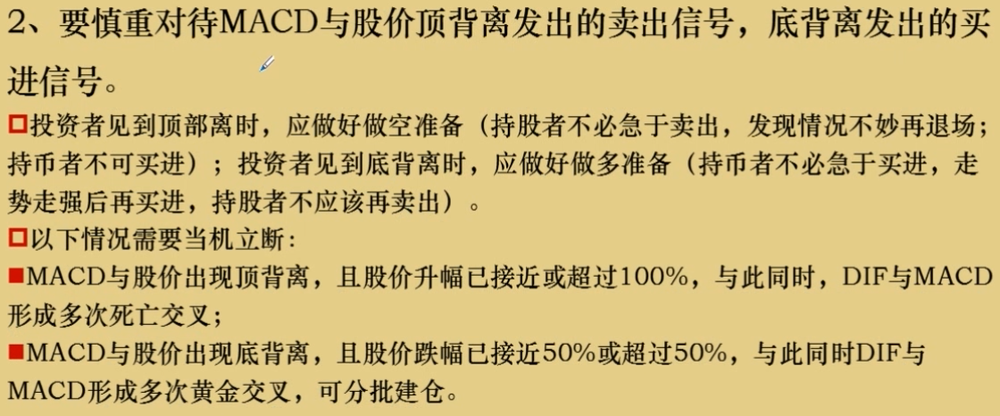

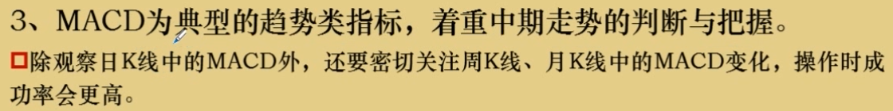

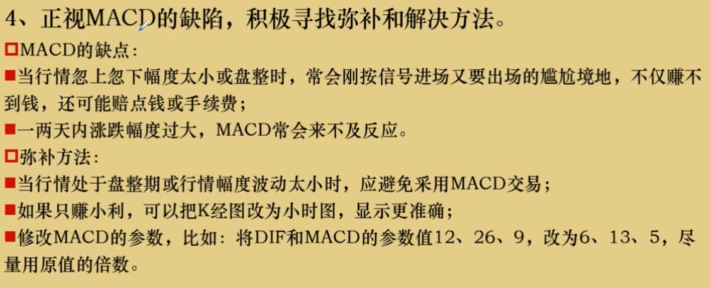

