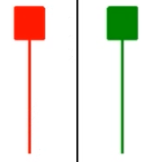
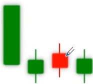

# K 线基础知识

## 上升形态和见底形态

| 名称                             | 图形                                                         | 特征                                                         | 含义                                         | 备注                                                         |
| -------------------------------- | ------------------------------------------------------------ | ------------------------------------------------------------ | -------------------------------------------- | ------------------------------------------------------------ |
| 早晨十字星(希望十字星)           |  | 出现在下跌行情中                                             | 见底信号, 后市看涨                           |                                                              |
| 早晨之星(希望之星)               |  | 出现在下跌行情中                                             | 见底信号, 后市看涨                           | 信号不如早晨十字星强                                         |
| 好友反攻                         |  | 出现在下跌行情中. 由一阴一阳 2 根 K 线组成, 第 2 根 K 线跳空低开, 收盘时为一根中阳线或大阳线, 且收盘价与前一根 K 线相同或相近 | 见底信号, 后市看涨                           | 转势信号不如曙光初现强                                       |
| 曙光实现                         |  | 出现在下跌行情中. 由一阴一阳 2 根 K 线组成, 第 2 根 K 线实体深入到阴线实体的一半以上处 | 见底信号, 后市看涨                           | 阳线实体深入阴线实体的部分越多, 转势信号越强                 |
| 旭日东升                         |  | 出现在下跌趋势中                                             | 见底信号, 后市看涨                           | 见底信号, 强于曙光初现. 阳线实体调出阴线实体的部分越多, 转势信号越强 |
| 倒锤头线                         |  | 出现在下跌途中, 上影线大于等于实体的两倍                     | 见底信号, 后市看涨                           | 实体与上影线比例越悬殊, 信号越有参考价值. 如果倒锤头与早晨之星同时出现, 见底信号就更加可靠 |
| 锤头线                           |  | 出现在下跌途中. 下影线大于等于实体的两倍                     | 见底信号, 后市看涨                           | 实体与下影线比例越悬殊, 越有参考价值. 如果锤头线与早晨之星同时出现, 见底信号就更加可靠 |
| 平底(钳子底)                     |  | 出现在下跌趋势中. 最低价处在同一水平位置                     | 见底信号, 后市看涨                           |                                                              |
| 塔形底                           |  | 出现在下跌趋势中                                             | 见底信号, 后市看涨                           | 相当于早晨之星                                               |
| 圆弧底                           |  | 出现在下跌趋势中                                             | 见底信号, 后市看涨                           |                                                              |
| 低位并排阳线                     |  | 出现在下跌趋势中. 第一根阳线跳空低开, 收盘时在前一根 K 线下方形成缺口, 第二根阳线与第一根阳线并肩而立 | 见底信号, 后市看涨                           | 相当于好友反攻                                               |
| 低档五阳线                       |  | 出现在下跌趋势中. 连续出现 5(也可能是 6, 7) 根阳线(多为小阳线) | 见底信号, 后市看涨                           |                                                              |
| 连续跳空三阴线                   |  | 出现在下跌趋势中. 连续出现 3 根向下跳空低开的阴线            | 见底信号, 后市看涨                           | 如在股价已有大幅下挫的情况下出现, 见底的可能性大             |
| 跳空下跌三颗星                   |  | 出现在下跌趋势中. 3 根小阴线与上面一根 K 线有一个明显的缺口  | 见底信号                                     | 如果在 3 根小阴线后出现一根大阳线, 上涨的可能性更大          |
| 红三兵                           |  | 出现在上涨行情初期                                           | 买进信号, 后市看涨                           | 当 3 根小阳线收于最高或接近最高价时, 称为 3 个白色武士, 其拉升股价的作用要强于普通的红三兵 |
| 冉冉上升形                       |  | 在盘整的后期出现, 由若干根小 K 线组成(一般不少于 8 根), 其中以小阳线居多, 中间也可夹着小阴线或十字线. 整个 K 线排列成略微向上倾斜状 | 买进信号, 后市看涨                           | 升幅虽不大, 但往往是股价大幅上涨的前兆, 如成交量能同步放大, 这种可能性就很大 |
| 徐缓上升形                       |  | 多数出现在涨势初期                                           | 买进信号, 后市看涨                           | 相当于旭日东升                                               |
| 上升抵抗形                       |  | 在上涨途中出现. 连续跳空开盘, 即使中间收出阴线, 但收盘价也要比前一根 K 线的收盘价高 | 买进信号, 后市看涨                           |                                                              |
| 弧形线                           |  | 在涨势初期出现                                               | 买进信号, 后市看涨                           | 一旦弧形线被市场认可, 上涨周期就很长                         |
| 下控上涨形                       |  | 在上涨途中突然跳低开盘(甚至跌停板开盘), 当日以涨势收盘, 并收出一根大阳线(甚至以涨停板收盘) | 买进信号, 后市看涨                           | 多数为控盘庄家利用消息洗盘, 一般后市将有一段较大升势         |
| 两红夹一黑                       |  | 即可出现在涨势中, 也可出现在跌势中                           | 在涨势中出现继续看涨, 在跌势中出现是见底信号 |                                                              |
| 上涨两颗星                       |  | 在涨势初期, 中期出现, 第 2/3 根 K 线可以是小十字线/小阳线/小阴线 | 继续看涨                                     | 少数情况下会出现 3 根小 K 线, 这时称为上涨三颗星             |
| 跳空上扬形(升势鹤鸦缺口)         |  | 出现在涨势中, 收盘时留下一个缺口, 阴线收盘时在前一根阳线缺口上方附近 | 继续看涨                                     |                                                              |
| 高位并排阳线(升势恋人肩并肩缺口) |  | 出现在涨势中, 第二根阳线与第三根阳线的开盘价基本相同         | 继续看涨                                     | 这个缺口对后续股价走势有较强的支撑作用, 但如果发现股价跌破这个缺口, 股价走势就会较弱 |
| 上升三部曲(升势三鸦)             |  | 出现在上涨途中, 三根小阴线都没有跌破前面阳线的开盘价, 走势类似 "N" 字 | 继续看涨                                     |                                                              |
| 多方尖兵                         |  | 出现在上涨行情中, 第一根阳线留下一根较长的上影线, 接着股价回落, 但不久又涨至上影线的上方 | 继续看涨                                     | 实际上是多方进行的一次试盘                                   |
| 稳步上涨形                       |  | 出现在上涨行情中, 众多阳线中夹着较少的小阴线, 整个K线排列呈向上倾斜状 | 买进信号, 后市看涨                           | 后面的阳线对插入的阴线覆盖的速度越快越有力, 上升潜力就越大   |

## 下跌形态和滞涨形态

| 名称                 | 图形                                                         | 特征                                                         | 含义                                             | 备注                                                         |
| -------------------- | ------------------------------------------------------------ | ------------------------------------------------------------ | ------------------------------------------------ | ------------------------------------------------------------ |
| 黄昏十字星           |  | 出现在涨势途中, 第三根 K 线实体深入到第一根 K 线实体之内     | 见顶信号, 后市看跌                               |                                                              |
| 黄昏之星             |  | 出现在涨势途中                                               | 见顶信号, 后市看跌                               | 信号不如黄昏十字星                                           |
| 淡友反攻             |  | 出现在涨势中, 跳空开盘, 但收盘时为一根中阴线或大阴线, 且收盘价与前一根 K 线的收盘价相同或相近 | 见顶信号, 后市看跌                               | 转势信号不如乌云盖顶                                         |
| 乌云盖顶             |  | 出现在涨势中, 阴线已深入到阳线实体的二分之一以下处           | 见顶信号, 后市看跌                               | 阴线深入阳线实体部分越多, 转势信号越强                       |
| 倾盆大雨             |  | 出现在上涨趋势中                                             | 见顶信号, 后市看跌                               | 见顶信号强于乌云盖顶, 阴线实体低于阳线实体部分越多, 转势信号越强 |
| 射击之星(扫帚星)     |  | 出现在上涨趋势中, K 线实体很小, 上影线大于等于实体的两倍, 一般无下影线 | 见顶信号, 后市看跌                               | 实体与上影线比例越悬殊, 信号越有参考价值. 如射击之星与黄昏之星同时出现, 见顶信号就更加可靠 |
| 吊颈线               |  | 出现在涨势中, 下影线大于等于实体的两倍, 一般无上影线         | 见顶信号, 后市看跌                               | 实体与下影线比例越悬殊, 越有参考价值, 如吊颈线与黄昏之星同时出现, 见顶信号就更加可靠 |
| 平顶(钳子顶)         |  | 出现在涨势中, 最高价处在同一水平位置上                       | 见顶信号, 后市看跌                               |                                                              |
| 塔形顶               |  | 出现在上涨趋势中                                             | 见顶信号, 后市看跌                               | 相当于黄昏之星                                               |
| 圆顶                 |  | 出现在上涨趋势中                                             | 见顶信号, 后市看跌                               | K 线的圆顶与技术图形的圆顶有一定区别                         |
| 双飞乌鸦             |  | 出现在上涨趋势中, 第一根阴线的收盘价高于前一根阳线的收盘价, 且第二根阴线完全包含了第一根阴线 | 见顶信号, 后市看跌                               |                                                              |
| 三只乌鸦(暴跌三杰)   |  | 出现在涨势中, 阴线多为大阴线或中阴线, 每次均以跳高开盘, 最后以下跌收盘 | 见顶信号, 后市看跌                               |                                                              |
| 高档五阴线           |  | 出现在涨势中, 阴线多为大阴线或中阴线, 每次均以跳高开盘, 最后以下跌收盘 | 见顶信号, 后市看跌                               | 高档五阴线不一定都是 5 根阴线, 有时可能是 6/7 根             |
| 下降覆盖线           |  | 在上涨行情中出现, 前 2 根 K 线构成一个穿头破脚形态, 第三根 K 线是一根中阳线或小阳线, 但阳线实体通常比前一根阴线要短, 之后是一根中阴线或小阴线, 阴线实体已深入到前一根阳线实体中 | 见顶信号, 后市看跌                               | 见顶信号要强于穿头破脚                                       |
| 低档盘旋形           |  | 出现在下跌途中                                               | 卖出信号, 后市看跌                               |                                                              |
| 黑三兵               |  | 即可在涨势中出现, 也可在跌势中出现                           | 卖出信号, 后市看跌                               |                                                              |
| 下跌不止形           |  | 出现在下跌途中, 整个 K 线排列呈向下倾斜状                    | 卖出信号, 后市看跌                               |                                                              |
| 阳线跛脚形           |  | 出现在涨势中, 最后 2 根阳线都是低开, 且最后 1 根阳线收盘价比前面阳线收盘价要低 | 滞涨信号, 后市看淡                               |                                                              |
| 倒三阳               |  | 出现在下跌初期, 每日都是低开高走, 后 2 根 K 线收盘价都低于或接近前一天的阳线开盘价, 图形上类似连续 3 根阴线的跌势 | 卖出信号, 后市看跌                               | 多数发生在庄家股上, 下跌概率极大                             |
| 徐缓下跌形           |  | 多数出现在跌势初期                                           | 卖出信号, 后市看跌                               |                                                              |
| 下降抵抗形           |  | 出现在下跌途中, 连续跳低开盘, 即使中间出现阳线, 但收盘价也要比前一根 K 线的收盘价低 | 卖出信号, 后市看跌                               |                                                              |
| 高开出逃形           |  | 突然跳高开盘, 甚至以涨停开盘, 最后收盘为一根大阴线(甚至以跌停板收盘) | 卖出信号, 后市看跌                               | 多数为被套庄家利用朦胧消息拉高出货所致, 一般后市将在一段较大跌势 |
| 绵绵阴跌形           |  | 在盘整后期出现, 由若干根小 K 线组成(一般不少于8根), 其中以小阴线居多, 整个 K 线排列呈略微向下倾斜状 | 卖出信号, 后市看跌                               |                                                              |
| 下跌三颗星           |  | 在下跌行情初期, 中期出现                                     | 卖出信号, 后市看跌                               | 表明市场买卖意愿不强, 市场将以盘整下跌为主                   |
| 下降三部曲(降势三鹤) |  | 出现在下跌趋势中                                             | 卖出信号, 后市看跌                               |                                                              |
| 空方尖兵             |  | 出现在下跌行情中, 收盘时留下一根较长的下影线, 然后股价反弹, 但不久股价又跌至下影线下方 | 卖出信号, 后市看跌                               | 走势出现这种形态, 为空方主力的一次试盘                       |
| 连续跳空三阳线       |  | 出现在上涨行情中, 连续出现 3 根向上跳空高开的阳线            | 滞涨信号, 后市看淡                               |                                                              |
| 升势受阻             |  | 出现在涨势中, 3 根阳线实体越来越小, 最后一根阳线的上影线很长 | 滞涨信号, 后市看淡                               |                                                              |
| 升势停顿             |  | 出现在涨势中, 第三根阳线实体很小, 反映上升的势头可能停顿     | 滞涨信号, 后市看淡                               |                                                              |
| 两黑夹一红           |  | 即可出现在涨势中, 也可出现在跌势中                           | 在涨势中出现, 是见顶信号, 在跌势中出现, 继续看跌 |                                                              |

## 即是上升形态又是下跌形态

| 名称       | 图形                                                         | 特征                                                         | 含义                                                         | 备注                                                         |
| ---------- | ------------------------------------------------------------ | ------------------------------------------------------------ | ------------------------------------------------------------ | ------------------------------------------------------------ |
| 大阳线     |  | 阳线实体较长, 可略带上/下影线                                | 1. 在上涨刚开始时, 出现大阳线, 后市看涨 2. 在上涨途中出现大阳线时, 继续看涨 3. 在连续加速上涨行情中出现大阳线, 是见顶信号 4. 在连续下跌的行情中出现大阳线, 有见底回升的意义 | 阳线实体越长, 信号越可靠                                     |
| 小阳线     |  | 在盘整行情中出现较多, 也可以在上涨和下跌行情中出现, 阳线实体较小, 可略带上/下影线 | 说明行情不明朗, 多空双方小心接触, 但多方略占上风             |                                                              |
| 大阴线     |  | 可出现在任何情况下                                           | 1. 在涨势中出现, 是见顶信号 2. 在下跌初期出现, 后市看跌 3. 在下跌途中出现, 继续看跌 4. 在连续下跌行情中出现, 有空头陷阱之嫌疑 |                                                              |
| 小阴线     |  | 在盘整行情中出现较多, 也可在上涨和下跌行情中出现             | 说明行情不明朗, 多空双方小心接触, 但空方略占优势             |                                                              |
| 十字线     |  | 即可出现在涨势中, 也可出现在跌势中                           | 1. 在上涨趋势末期出现, 是见顶信号 2. 在下跌趋势末期出现, 是见底信号 3. 在上涨途中出现, 继续看涨 4. 在下跌途中出现, 继续看跌 | 信号可靠性不强, 应结合其它 K 线一起研判                      |
| 长十字线   |  | 即可出现在涨势中, 也可出现在跌势中                           | 1. 在上涨趋势末期出现, 是见顶信号 2. 在下跌趋势末期出现, 是见底信号 3. 在上涨途中出现, 继续看涨 4. 在下跌途中出现, 继续看跌 | 比一般十字线信号要可靠                                       |
| 螺旋桨     |  | 即可出现在涨势中, 也可出现在跌势中                           | 1. 在涨势中出现, 后市看跌 2. 在下跌途中出现, 继续看跌 3. 在连续加速下跌行情中出现, 有见底回升的意义 | 转势信号比长十字线更强                                       |
| 一字线     |  | 即可出现在涨势中, 也可出现在跌势中, 开盘/收盘/最高/最低价几乎相同 | 1. 在上涨趋势中出现, 是买进信号 2. 在下跌趋势中出现, 是卖出信号 | 在涨跌停板制度下, 一字线有特别意义 1. 涨势中出现一字线, 表示股价封在涨停价上, 说明多头气盛, 日后该股往往会变成强势股 2. 跌势中出现一字线, 表示股价封杀在跌停价上, 说明空头力量极强, 日后该股往往会变成弱势股 |
| T 字线     |  | 开盘价/收盘价/最高价相同, 但最低价与之有相当的距离           | 1. 在上涨趋势末端出现, 为卖出信号 2. 在下跌趋势末端出现, 为买进信号 3. 在上涨途中出现, 继续看涨 4. 在下跌途中出现, 继续看跌 | T 字线下影线越长, 信号越可靠                                 |
| 倒 T 字线  |  | 开盘价/收盘价/最低价相同, 但最高价与之有相当的距离           | 1. 在上涨趋势末端出现, 为卖出信号 2. 在下跌趋势末端出现, 为买进信号 3. 在上涨途中出现, 继续看涨 4. 在下跌途中出现, 继续看跌 | 倒 T 字线上影线越长, 信号越可靠, 在上升趋势中出现倒 T 字线, 称为上档倒 T 字线, 又称下跌转折线 |
| 搓揉线     |  | 多数出现在涨势中, 由一正一反两根 T 线组成                    | 1. 在上涨途中出现, 继续看涨 2. 在上涨末端出现, 是见顶信号 | 在上涨途中出现以小 T 字线居多, 在上涨末端出现以大 T 字线居多 |
| 尽头线     |  | 即可出现在涨势中, 也可出现在跌势中, 第二根 K 线为小十字(或小阴线, 小阳线), 依附在第一根 K 线的上影线或下影线之内 | 1. 出现在涨势中, 是见顶信号 2. 出现在跌势中, 是见底信号   | 尽头线的上影线或下影线的右方, 带着的 K 线越小, 信号越强      |
| 身怀六甲   |  | 即可出现在涨势中, 也可出现在跌势中, 第一根 K 线实体完全包含第二根 K 线实体 | 1. 出现在涨势中, 是卖出信号 2. 出现在跌势中, 是买进信号  | 若第二根 K 线为十字线, 称为十字胎, 是转势力度最大的 K 线形态之一 |
| 穿头破脚   |  | 即可出现在涨势中, 也可出现在跌势中, 后者将前者实体完全包容在内, 在上涨趋势中, 前一根为阳线, 在下跌趋势中, 前一根为阴线 | 1. 出现在涨势中, 是卖出信号 2. 出现在跌势中, 是买进信号  | 两根 K 线长短越悬殊, 或一根长的 K 线包容前面的 K 线越多, 信号就越有参考价值 |
| 镊子线     |  | 即可出现在涨势中, 也可出现在跌势中, 上涨时, 3 根 K 线实体的最高价相同, 下跌时最低价相同 | 1. 出现在涨势中, 是头部信号 2. 出现在跌势中, 是底部信号  |                                                              |
| 上档盘旋形 |  | 出现在上涨途中                                               | 上涨盘旋时间在 5~14 天内, 超过 14 天多数看跌                 | 盘旋时间太久, 说明多方上攻愿意不强, 因而跌的可能性很大       |
| 加速度线   |  | 即可出现在涨势中, 也可出现在跌势中                           | 1. 出现在涨势中, 是头部信号 2. 出现在跌势中, 是底部信号  |                                                              |
| 下跌三连阴 |  | 出现在跌势中, 每根阴线都以最低价或次低价收盘, 最后一根阴线往往是大阴线 | 1. 在下跌初期出现, 继续看跌 2. 在下跌后期出现, 是见底信号 | 在连续阴跌不止的情况下, 特别是在股价已有较大跌幅后出现三连阴, 表明空方力量已用尽 |

