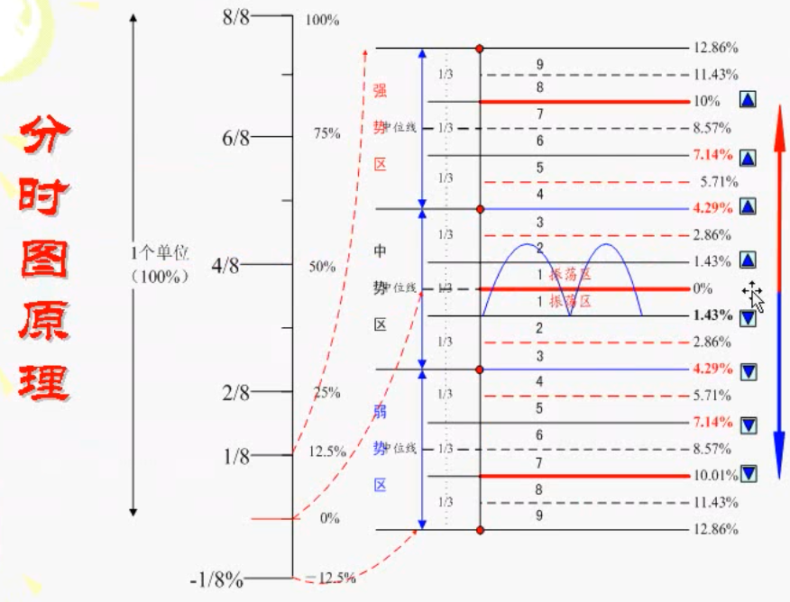
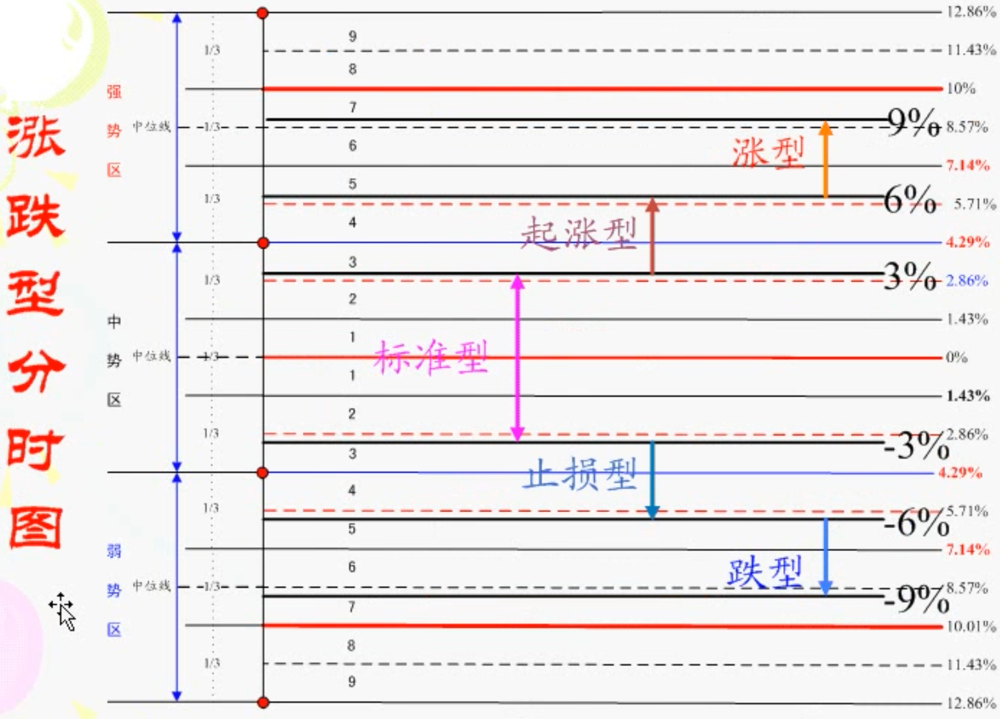
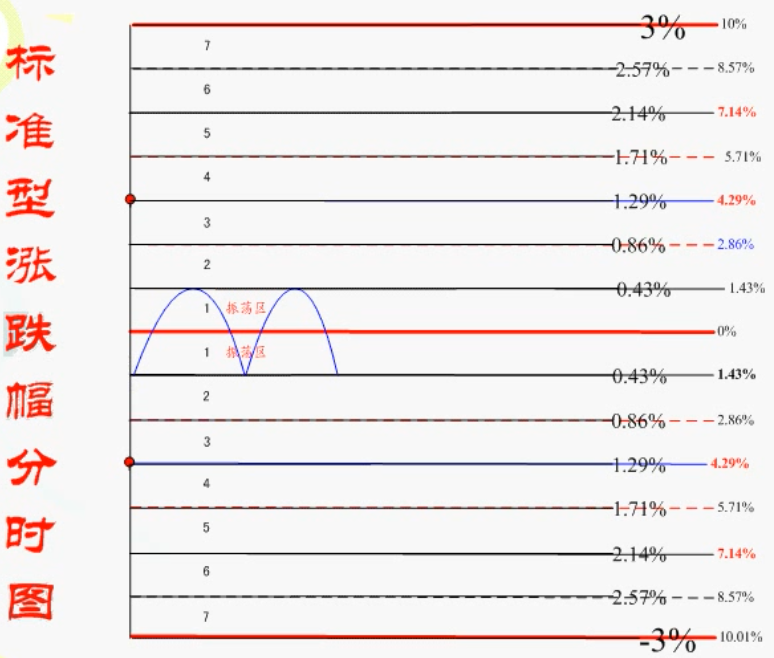

# 分时图

## 分时图 1/8 原理

### 分时图箱体

- 在 0% 处假定为股价 10元, 股价上涨 100% 到 20 元, 作为 1 个单位
- 将 1 个单位进行 8 等分, 可以得到每格为 12.5% 每格即为一个分时箱体
- 而一般股票, 涨/跌停价格为开盘价的 10%, 由 8 等分的方式得到的分时箱体与涨跌幅制度以 10% 为一个分时箱体不同, 因此在这里做了一定的缩放, 这是为了使 1/8 箱体能够对应到股价百分比中(即 12.5% 为一个箱体在股价百分比中为:  12.86% 为一个箱体)
- 一般来说, 以股价最低收盘价为 0 轴线, 如果涨了 12.86%, 就认为涨了 1 个箱体

### 箱体划分

- 从 0 轴线向上的 12.86% 箱体中, 进行 3 等分获得 3 个小箱体, 再分别进行 3 等分, 得到 9 小格, 同理, 在 0 轴向下的 12.86% 箱体中也可以得到相同的 9 小格
- 收盘价达到 4.29%, 8.57%, 12.86% 时视为进入到另一个小箱体, 如果股价一直处于 0 ~ 4.29% 之间, 则认为股价在一个小箱体内震荡
- 当股价以涨停板收盘时, 第 2 天股价需要再向上涨 2.85%(即再向上涨 2 小格) 才算是进入了另一个箱体

### 强, 中, 弱势区划分

- 4.29% ~ 12.86% 为强势区
- -4.29% ~ 4.29% 为中势区
- -12.86% ~ -4.29% 为弱势区

### 分时图的类型

#### 标准型涨跌幅分时图

#### 大盘的分时图类型

- 在大盘中, 以 -1% ~ 1% 为标准型
- 1% ~ 2% 为起涨(止损)型
- 2% ~ 3% 为涨(跌)型

