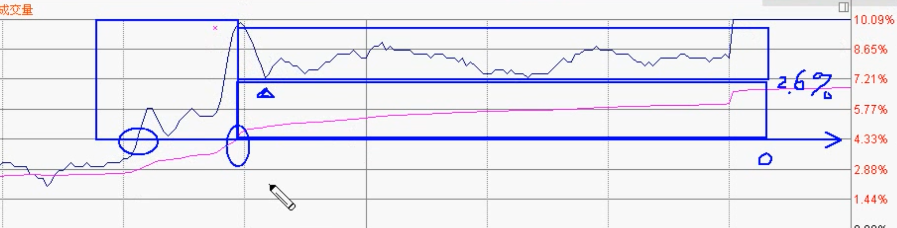

# 分时图

## 分时图 1/8 原理

### 分时图箱体

- 在 0% 处假定为股价 10元, 股价上涨 100% 到 20 元, 作为 1 个单位
- 将 1 个单位进行 8 等分, 可以得到每格为 12.5% 每格即为一个分时箱体
- 而一般股票, 涨/跌停价格为开盘价的 10%, 由 8 等分的方式得到的分时箱体与涨跌幅制度以 10% 为一个分时箱体不同, 因此在这里做了一定的缩放, 这是为了使 1/8 箱体能够对应到股价百分比中(即 12.5% 为一个箱体在股价百分比中为:  12.86% 为一个箱体)
- 一般来说, 以股价最低收盘价为 0 轴线, 如果涨了 12.86%, 就认为涨了 1 个箱体

### 箱体划分

- 从 0 轴线向上的 12.86% 箱体中, 进行 3 等分获得 3 个小箱体, 再分别进行 3 等分, 得到 9 小格, 同理, 在 0 轴向下的 12.86% 箱体中也可以得到相同的 9 小格
- 收盘价达到 4.29%, 8.57%, 12.86% 时视为进入到另一个小箱体, 如果股价一直处于 0 ~ 4.29% 之间, 则认为股价在一个小箱体内震荡
- 当股价以涨停板收盘时, 第 2 天股价需要再向上涨 2.85%(即再向上涨 2 小格) 才算是进入了另一个箱体

### 强, 中, 弱势区划分

- 4.29% ~ 12.86% 为强势区
- -4.29% ~ 4.29% 为中势区
- -12.86% ~ -4.29% 为弱势区

### 分时图的类型

#### 大盘的分时图类型

- 在大盘中, 以 -1% ~ 1% 为标准型
- 1% ~ 2% 为起涨(止损)型
- 2% ~ 3% 为涨(跌)型

## 三段九格法

## 标准型涨跌幅分时图

分时图箱体位的分界: 1.43%, 4.29%, 7.14%, 10%

以标准型的 3% 为界时, 箱体位的分界则为: 0.43%, 1.29%, 2.14%, 3%

## 多天的分时

- 1 天或 2 天分时看百分比位置(关注 1.29% 分界)
  - 每天的标准型箱体按 3% 来进行查看
  - 前一天 2:30 的均价点即为今天的一个支撑点
- 3天分时看趋势和画线
  - 将昨天与前天 2:30 的均价点进行连线, 连线后, 如果是下降线, 就以前天的点做一条水平线, 并将下降线延水平线做另一条对称的上升线
  - 以前天的最高价为点, 做一个与上升线的平行线
  - 确定平行线之间的格数距离, 再向上做一条平行线, 即可形成一个箱体, 由此判断出支撑点, 压力点等情况及价位
  - 即可确定出今天的股价趋势情况
- 7天分时看箱体
  - 7天分时从上到下一共有14格, 如果是上涨, 从最底部开始向上算起, 第 3/6/9/11 格为一个箱体, 再回抽(股价回调)一个格子, 再向上 3 格为一个箱体
  - 如果是下跌, 则从最顶部开始向下算起
  - 中线上下第一格为振荡区
  - 注意第 3, 6, 8, 11, 13 位置, 就是压力/支撑位

## 分时图重要时间窗

### 9:33 均价

使用 9:33 分均价, 通过 2%, 3%, 4%, 6%, 8%(或负数)的幅度来预测出可能上升或下跌的价位, 并划分出相应的箱体

### 9:30 - 10:15 区间高低点箱体(45 分钟测高法)

- 关注区间内的最高价和最低价, 作为一个箱体, 并向上或向下构建相同高度的箱体
- 在第一个箱体与分时线相交处做一条垂直线, 并使用对角线连接, 可以得到一个趋势线
- 在趋势线与第二个箱体相交处再做一条垂直线, 并使用对角线连接, 依此类推

### 大单买卖预测后势

- 确定大单买卖点的位置, 以这个位置为新的 0 轴线, 向上或向下以 3% 幅度间隔画出箱体
- 将第一个箱体与分时线相交处的点做一个垂直线, 并使用对角线连接
- 同理通过交点, 做出其它的对角线, 形成价格趋势线

## 分时图系数法箱体

### 通过前 2 天收盘价判断走势

- 通过前 2 天收盘价 ×(或除) 2.6%(系数) 来判断近期走势的强弱
- 在前天的收盘价处画一条水平线, 以 2.6% 为一个箱体进行划分
- 在当天的开盘价与箱体相交的点, 使用对角线进行连接, 可以得到对应的趋势线

### 通过今日收盘价判断走势

- 用今日收盘价 ×(或除) 2.6%(系数) 来判断明后 2 天箱体
- 在当天收盘价处画一条水平线, 以 2.6% 为一个箱体进行划分
- 可以预测得到明天的价位走势, 及压力位和支撑位

### 通过分时图的价格与均价线进行判断买卖价位

- 用分时图价格与均价线的比较来判断买卖价位(箱体按 2.6% ~ 3.5% 系数)
- 在分时图价格的庄家拉升点与当前均价点连接, 做水平线
- 向上或向下 2.6% ~ 3.5% 为一个箱体进行划分, 可得到对应的操作箱体

### 通过日 K 线波段最低收盘价, 推导出分时箱体中重要价位

- 通过日 K 线波段最低收盘价, 运用 30% 箱体原理推导出分时箱体中重要价位
- 找出日 K 线最低价位, 再向上 30% 划分箱体, 箱体中也进行 3 等分, 得到相关的压力位和支撑位

## 分时图追涨法

### ±10% 形态时的追涨原则

- 0% ~ 2.6% 为买入区
- 2.6% ~ 4.29% 为追入区
- 进入强势区后, 4.29% ~ 5.71% 为过渡区

### 分时图中买入点和追涨点

- 股价在 1.43% 以上同时放量时(量为昨日 5 日成交均量 × 1%), 则是一个买入点
- 股价在 1.43% 或 4.29% 以上同时放量时(量为昨日 5 日成交均量超过 2%), 则是一个追涨点

> 按常规统计, 股价在放量时, 成交量达到了昨天 5 日成交均量 ×2% 的 3 ~ 5 倍时, 一般股价都可以超过 6% ~ 8%, 如果是 5 倍以上, 股价可以达到涨停板

### 分时图中不封涨停板时的操作

- 不封涨停板时, 支撑位为 4.29% 和 7.14%
- 对于明天股价来说, 4.29% 是一个止损点

### 分时图中涨停板后第 2 天的操作

- 第 2 天如果股价没有越过 4.29%, 可以作为一个短期卖出点
- 如果跌入 2.6% 以下, 则作为一个止盈点
- 昨天涨停板的成交均价点或 -3% 左右的点为一个回补点(同时这也是一个支撑位)

> 关注涨停板分时图中当日 7.14% 位置的价格, 因为这是第 2 天的一个回补点(支撑位)

## 分时图杀跌法

### 分时图中分段止损法

强势区的止损点

- 第一止损点: 9.3%
- 第二止损点: 8.6%
- 第三止损点: 7.14%

股价跌破强势区的过渡区时, 进入中势区

- 第一止损点: 4.29%
- 第二止损点: 2.6%
- 第三止损点: 0%
- 第四止损点: -2.6%
- 第五止损点: -4.29%

股价跌破弱势区的过渡区(-4.29% ~ -7.14%)时, 弱势区的止损点

- 第一止损点: -7.14%

### 日 K 线上影线第二天 1/2 位在分时图中的止损法

### 波段最高收盘价, 在第二天分时图中下跌 2% 止损法

- 确定最高收盘价, 可得到收盘价下降 2 %处的支撑位

## 指数分时图

### 通过上证综指判断后市趋势

- 通过在 11:30 与 13:48 的差值, 划出箱体, 并向上向下画出等高的箱体, 从而得到相应的支撑点
- 连接对角线可获得趋势线

### 通过上证综指百分比点位的止损区判断

#### 大盘的分时图类型

- 在大盘中, 以 -1% ~ 1% 为标准型
- 1% ~ 2% 为起涨(止损)型
- 2% ~ 3% 为涨(跌)型
- 以 1.5% 作为上证综指的止盈止损点

### 通过分时图 10:15 ~ 10:45 的走势判断后市

- 通过 10:15 ~ 10:45 的走势, 对 14:30 后市场走势方向进行判断
- 通过 10:15 ~ 10:45 的价格点画出箱体, 连接对角线, 可以大致判断出 14:30 后的走势

### 通过分时图  11:15 ~ 11:30 及 13:30 ~ 13:45 区间进行判断

- 在 11:15 ~ 11:30 及 13:30 ~ 13:45 的价格点分别画出箱体
- 连接对角线, 可以大致判断出走势

### 通过分时图中股市对偶定律的对比操作进行判断

- 选出2个最低点(或最高点)可画出 2 个箱体, 从 0 轴开始画对角线, 可以得到相对应的支撑位和压力位

## 分时图操作

### 分时图中波浪点的设定

如果股价从 0 轴线开盘时的波浪

- 走 2 回 1 型(弱势型): 价格向上走 2 格, 并回 1 格, 再向上到第 3 格到 4.29%
- 走 3 回 2 型(中势型): 价格向上走 3 格, 并回 2 格, 再向上到第 4 格到 5.71%
- 走 3 回 1 型(强势型): 价格向上走 3 格, 并回 1 格, 再向上到第 5 格到 7.14%

### 分时图中重要价格位出现在固有定格位中的分析

- 关注特殊价格(如: 3.44, 3.33, 4.56, 6.78, 8.76 等), 如果与分时图百分比对应时, 则是一个很好的箱体操作定位点

### 分时图中走势左上角价格运动规律, 对当前止盈止损的分析

### 日 K 线跳空第三天分时图中的 14:30 分时均价线价格及收盘价格对后市操作

- 可在日 K 图中画出 14:30 分和收盘价的价格线, 再找到另一个日 K 线跳空第三天的点, 做同样的线条, 形成一个箱体
- 在这个箱体进行 2 等分, 同时也可以向上或向下做等高的箱体, 这些箱体将是一个支撑位和压力位

## 分时图 T + 0 的波段操作

## 分时图三段九格法扩展

- 实际操作可通过连续涨停板画扩展箱体(比较容易得到箱体)
- 在一个标准分时图, 向上再扩展 2 个 1/8 箱体
- 从最底部的 0 轴线开始向上(操作时以开盘价为 0 轴线), 每 3 格为一个操作箱体

####  重要的位置

- 第 1 个箱体: 第 3, 6 格
- 第 2 个箱体: 第 2, 5 格
- 第 3 个箱体: 第 1, 4, 7 格
- 一般股价从 0 %处上涨时, 以 3 个箱体(33%) 为目标, 合计 3 个 1/8 箱体, 共 21 格
- 如果股价再次向上, 则是另一个新的 1/8 箱体

