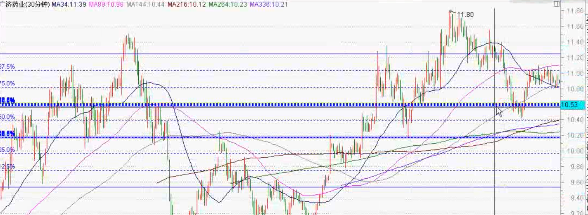

# 均线

## 1 分钟均价线

> 配合使用于分时图中的追涨杀跌

### 均价线参数

- 移动平均线设置: 3, 12, <u>36</u>, <u>108</u>, 144(警示线), <u>180</u>(强弱分界线), 252, 360
- 关注 36 日移动平均线

## 5 分钟均价线

> 配合使用于分时图中的追涨杀跌及箱体的挂单操作

### 均价线参数

- 移动平均线设置: 3, 12, <u>48</u>, <u>168</u>(警示线), 240, <u>336</u>(强弱分界线), 624
- 关注 48 日移动平均线

## 15 分钟均价线

> 配合于分时图中的追涨杀跌及判断个股的强弱使用

### 均价线参数

- 移动平均线设置: 3, 17, <u>55(或 60)</u>, <u>120</u>(警示线), <u>250</u>(强弱分界线), 440(或 480)
- 关注 55(或 60) 日移动平均线

## 30 分钟均价线

> 寻找个股操作的规律性

### 均价线参数

- 移动平均线设置: 34, <u>89</u>, <u>144</u>, 176, 216, 264, <u>336</u>, 528, 672
- 操作中, 关注 89, 144 日移动平均线之间的差别产生箱体的位置

- 可以在均线的交点处开始, 在股价与均线相交点作为结束, 画出波段线, 形成箱体
- 第 3, 5, 8 格的上边线处为重要支撑位和压力位
- 将波段线向上移动一个箱体的高度, 可得到另外一个箱体

## 60 分钟均价线

> 寻找买卖筹码的区域

### 均价线参数

- 移动平均线设置: 2, <u>12</u>(关注), 40, <u>80</u>(庄家线), <u>168</u>(反转线), 264(波段操作), <u>336</u>, 360, 396, 588

## 每日均价线(日 K 线)

> 寻找主力和阻力的均价线

### 均价线参数

- 移动平均线设置: 2, 5, <u>15</u>, 30, 42(反转线), <u>60</u>, <u>105</u>, <u>184</u>, 231, <u>354</u>, 366
- MA2 看方向, MA5 为成本线, MA15 线上做多, MA42 是反转线
- MA60 是中线, MA105 是中长线

- 在死叉点画线, 在 MA2 转向的点画线, 形成一个区间, 可得到压力位和支撑位

## 均价线金死叉点的短中线操作

### 金死叉点: MA2 与 MA5, MA5 与 MA15

- 在金叉点和死叉点处画波段线, 可以得到 1 个箱体
- 第 3, 5, 8 格的上边线处为重要支撑位和压力位
- 将波段线向上移动一个箱体的高度, 可得到另外一个箱体

### 金死叉点: MA5 与 MA30, MA5 与 MA60

- 形成金叉时, 在金叉点<u>向下</u>到最低点处画波段线
- 形成死叉时, 在死叉点<u>向上</u>到最高点处画波段线

### 金死叉点: MA30 与 MA60

- 形成金叉时, 在金叉点到金叉点当天的收盘价处画波段线

## 均价线金死叉点的中长线操作

### 金死叉点: MA5 与 MA105, MA5 与 MA231, MA30 与 MA184

- 形成金叉时, 在金叉点<u>向下</u>到最低点处画波段线
- 形成死叉时, 在死叉点<u>向上</u>到最高点处画波段线

### 金死叉点: MA5 与 MA184

- 在金叉点和死叉点处画波段线

### 金死叉点: MA5 与 MA354(或 MA366)

- 形成死叉时, 在死叉点与最高点处连线, 形成趋势线, 并做平行线, 连接旁边的最高最低点, 形成趋势通道
- 同时在趋势线的突破点之间可作为一个箱体进行操作

## MA5 与各中长线均线金叉点上 3% 的操作

### 中长线

- MA60
- MA105
- MA184
- MA231
- MA354(或366)

### 操作方法

- MA5 与 MA60 相交形成金叉具有一定的滞后性, 所以在前几天, 把收盘价在 MA60 以上的 K 线, 在这条 K 线当天的 MA60 价位向上 3% 画一条水平线, MA60 价位及这条水平线的区间作为中长线的操作平台
- 如果后续 MA5 继续向上形成金叉时, 做同样的操作, 可得到多个操作平台
- 每个平台区间之间, 形成一个箱体

