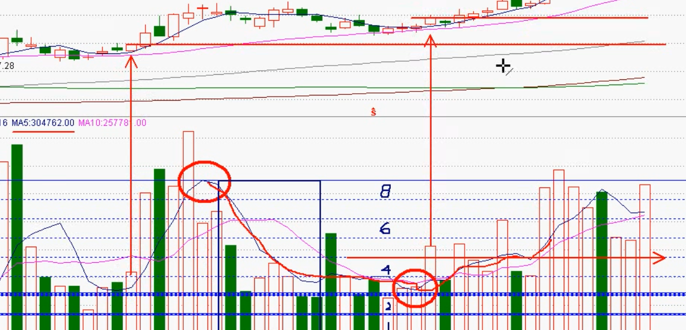
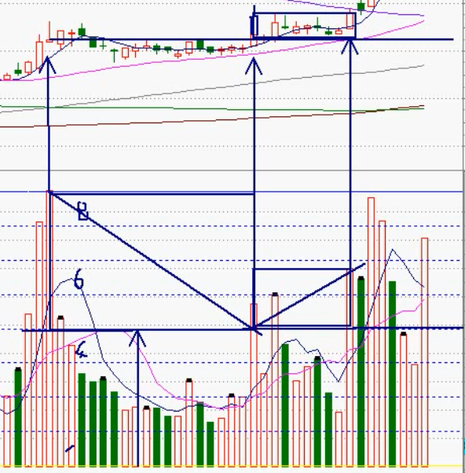
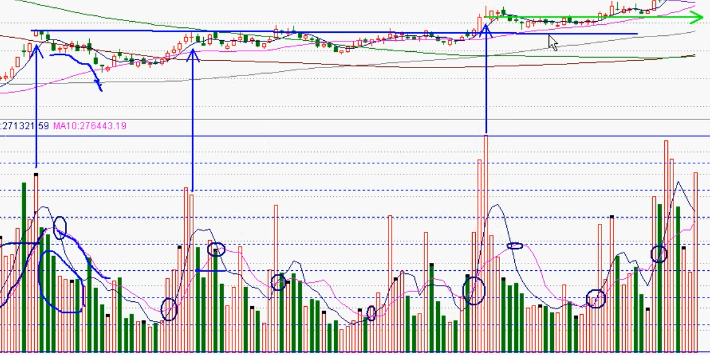

# 成交量

## 概念

### 换手率

换手率 = 成交量(1手, 即100股) ÷ 流通股

- 以 1% 为最低限度
- 以 2.5% 为操作限度, > 2.5% 时, 说明个股放量

### 量比

量比 = 今日成交量 ÷ 昨日 5 日均量线的值

> 当个股的成交量在 1 小时内超过 昨日 5 日均量线 和 昨日 10 日均量线, 个股在 低开高走/平开高走/高开高走 等形态, 可以考虑进行追涨

### 追涨杀跌量

今日每分钟成交量 与 昨日 MA5 1% 位 和 2% 位量的比较

- 股价在 1.43% 以上同时放量时(量为昨日 MA5 的 1%), 则是一个买入点
- 股价在 1.43% 或 4.29% 以上同时放量时(量为昨日 MA5 超过 2%), 则是一个追涨点
- 如果股价已经向上拉升一段时间了, MA5 形成放量, 则使用 MA5 的高点和低点的平均量, 再使用这个量进行 1%, 2% 的计算

> 一般地, 股价在放量时, 成交量达到了昨日 MA5 的 2% 的 3 ~ 5 倍时, 一般股价都可以超过 6% ~ 8%, 如果是 5 倍以上, 股价可以达到涨停板

### 散兵坑

- 从 0 轴到最高点处进行 8 等分, 成交量越过 1/8, 2/8 时需要注意
- 当成交量放量远超 2/8 时, 此时股价的收盘价是一个比较重要的点位

## 波段最高日成交量 1/2 位的操作

- 从 0 轴到最高成交量处进行 8 等分, 同时在最高成交量所在 K 线收盘价画水平线
- 在超过 1/2 处的成交量所在 K 线处所在 K 线收盘价画水平线, 形成一个箱体

## 金叉和死叉

- 形成金叉时, 成交量在 MA5 和 MA10 上方, 当成交量低于其中一条均量线, 在波段内得到一个最高成交量, 同时对应的收盘价为重要的支撑位和压力位, 按相同方法进行操作, 可获得相关的操作箱体
- 形成死叉时, 成交量在 MA5 和 MA10 下方, 操作方法与金叉相似

### 成交量波段间的分段比例箱体

