# 股市从不缺少机会, 宁可错过, 不可做错!

## GS 指标

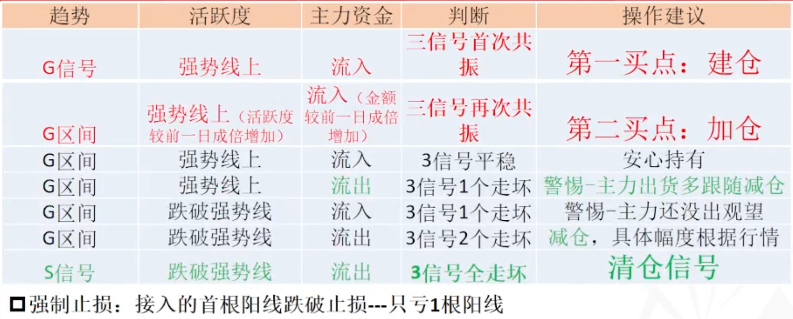

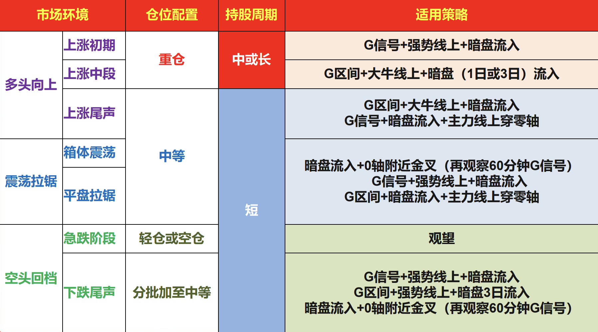

## 热门板块

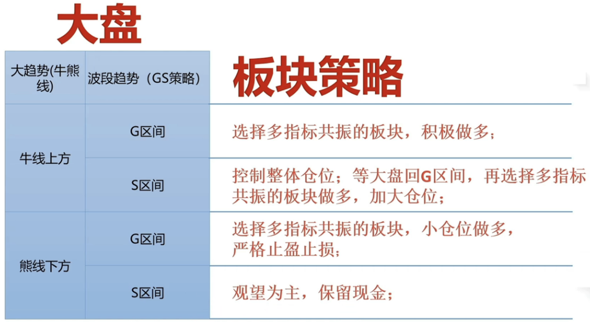

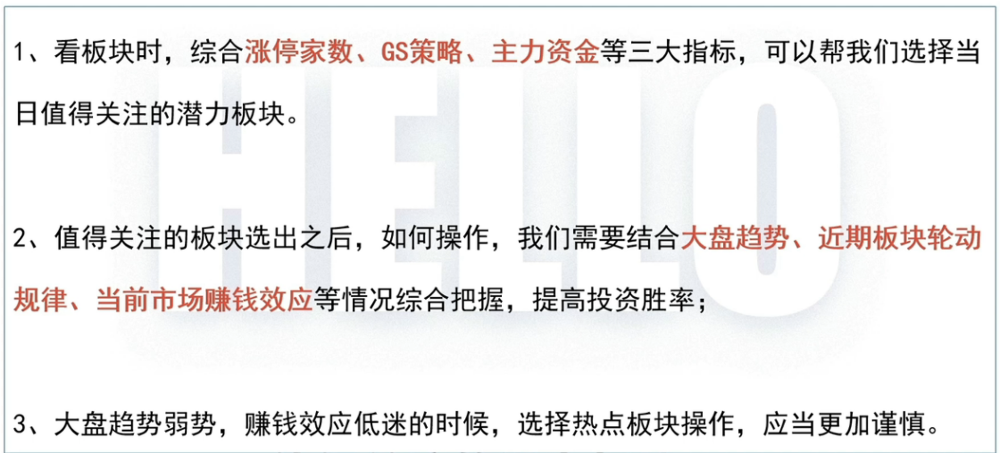

## 仓位控制

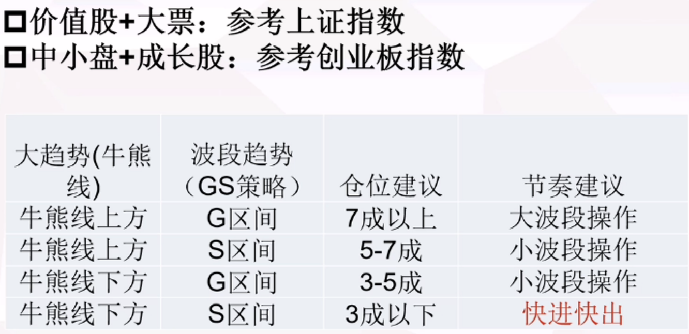

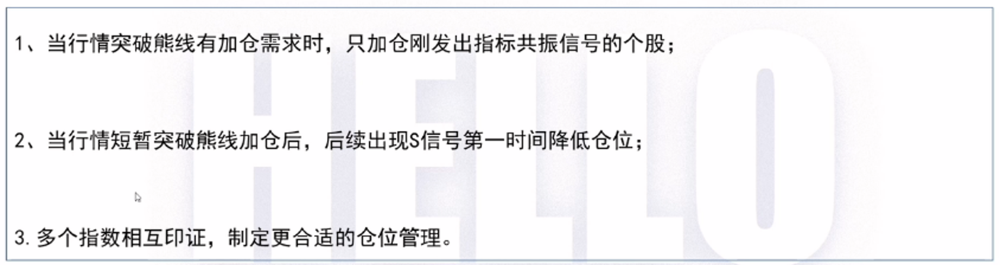

## 自建股池

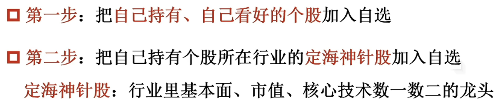

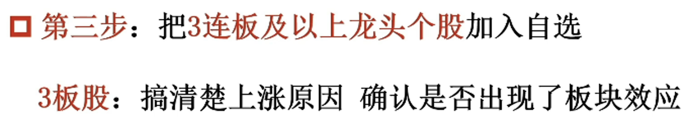

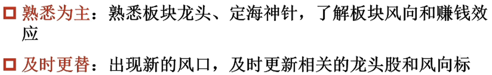

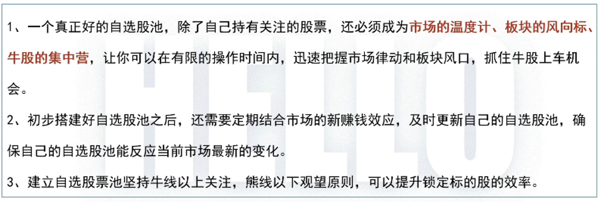

## 强势个股回踩买入

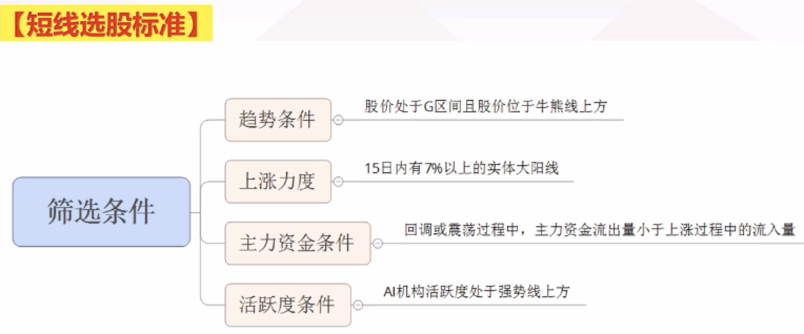

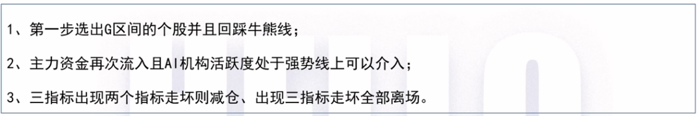

## 集合竞价

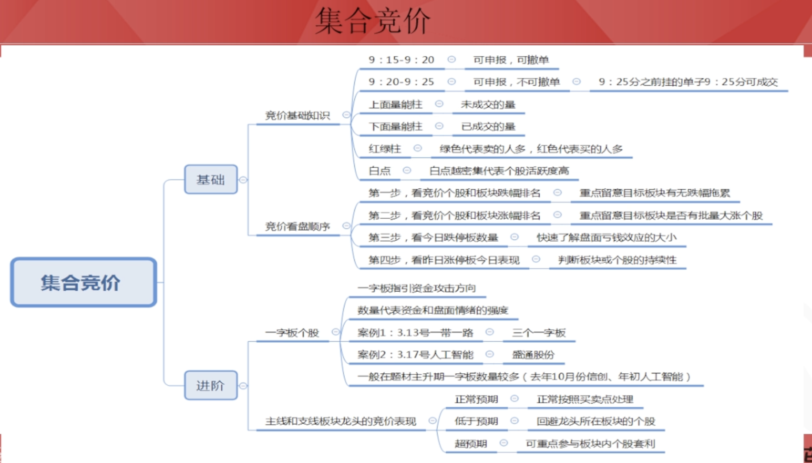

## 风险

大风险的情况下, 最好的卖点往往是开盘就卖

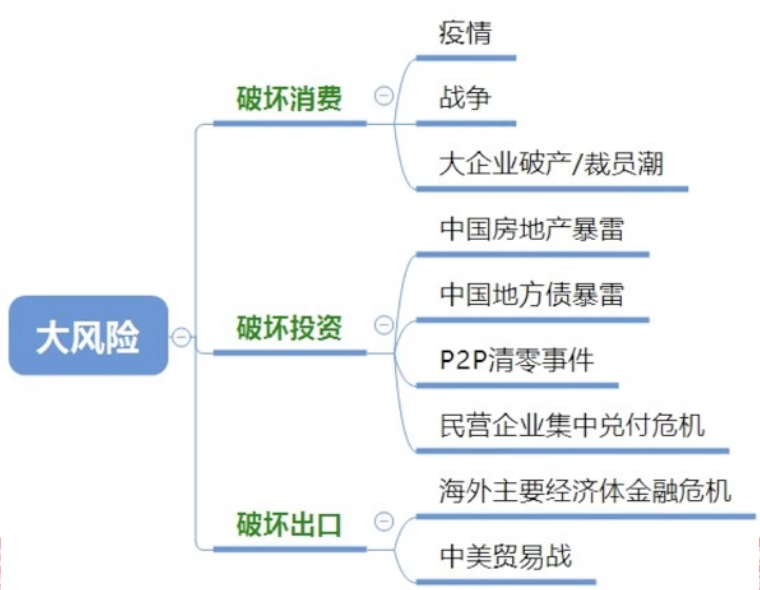

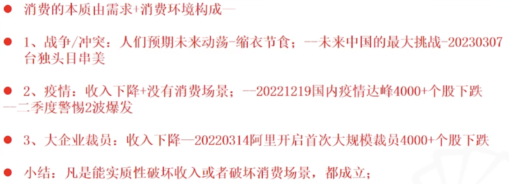

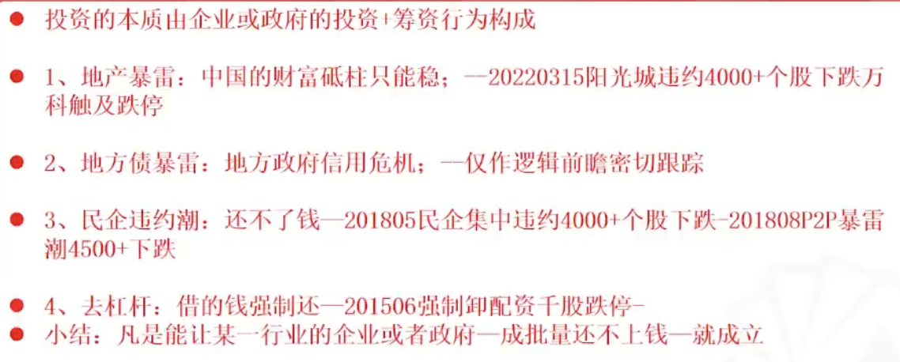

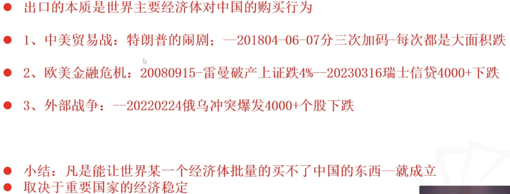

## 冰点数

- 当天上涨家数 < 1000 家
- 跌得越多, 反弹概率越高

## 确定一个个股的过程

- 板块
- 个股 确定股票在板块中的定位
- 指标 确定买卖点或减仓点

确定个股前期是否有过连续涨停, 如果存在高位了, 这个股票后续再出现信号时, 有可能只是超跌反弹, 不会持续很久, 主要是套利为主

如果板块龙头个股走阴线, 则个股需要注意一下

## 龙虎榜

- 可以看涨停股的龙虎榜
- 如果有大资金机构是纯买入, 0 卖出, 则非常有可能是真机构, 相当于做长期投资的那种!
- 可以在价格回到涨停价附近时买入, 并在后续卖出

## 席位

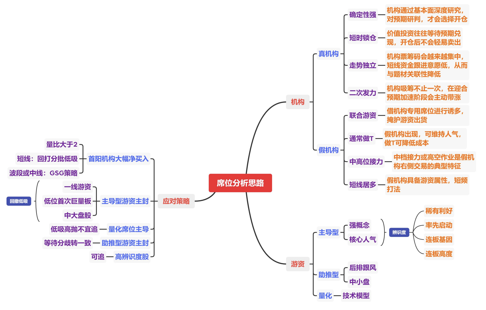

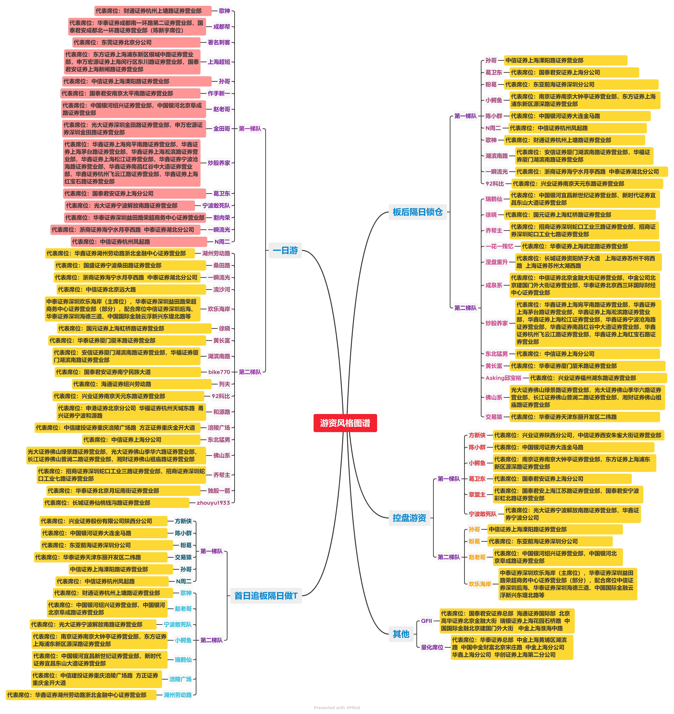

