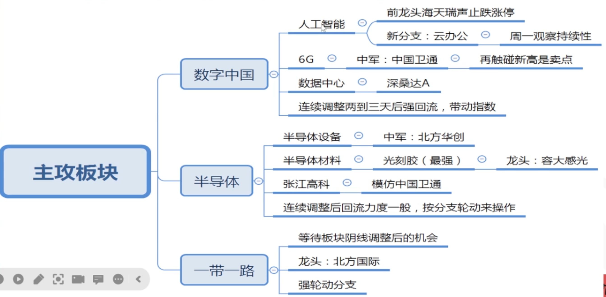
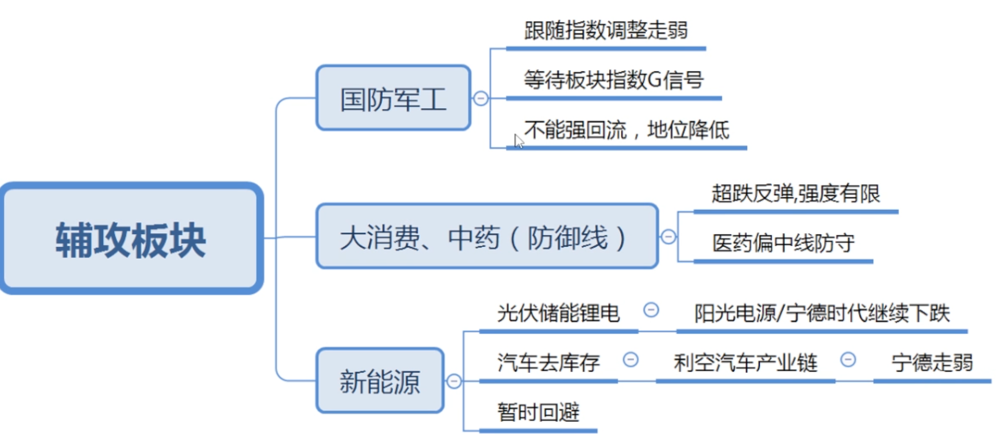

# Mar 19, 2023

## 注意项

- 周一大概率会走调整
- 题材股低位震荡区, 等板块走阴线调整时(主力资金有小部分流出)再考虑选股入场, 等拉升时高抛
- 重点留意光刻胶
- 一带一路等回调再入场

## 持有股票

| 股票     | GS     | 主要概念     | 备注            |
| -------- | ------ | ------------ | --------------- |
| 晶方科技 | G 区间 | 光刻胶, 芯片 |                 |
| 电科网安 | G 区间 | 芯片         |                 |
| 盘龙药业 | G 区间 | 中药         | 出现 S 信号离场 |

## 下周一考虑入场股票

| 股票     | GS     | 主要概念    | 备注                |
| -------- | ------ | ----------- | ------------------- |
| 立昂微   | G 区间 | 芯片        | G 信号 5 天, 有回调 |
| 元隆雅图 | G 区间 | AI, ChatGPT | G 信号 2天          |

## 下周观察GS信号

| 股票     | GS     | 主要概念       | 备注                          |
| -------- | ------ | -------------- | ----------------------------- |
| 苏美达   | S 区间 | 光伏, 一带一路 | 已有暗盘资金, 出现 G 信号入场 |
| 中铁工业 | G 区间 | 一带一路       | 考虑回调入场                  |

