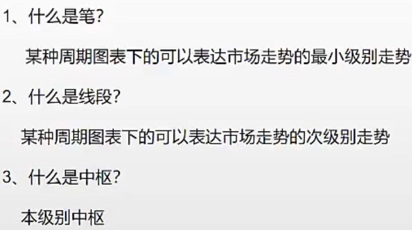
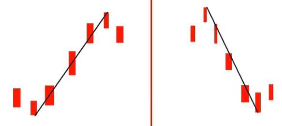
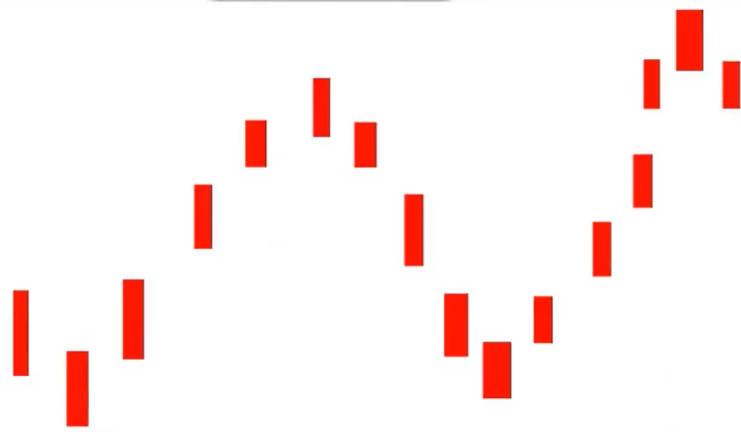
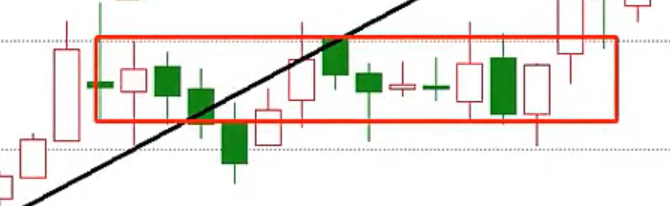

# 线段

- 中枢 **至少等于** 线段 × 3
- 线段 **至少等于** 笔 × 3

- 中枢是缠论的核心, 相当于人民币中的 元
- 线段 相当于 角, 笔 相当于 分

## 笔

笔的组成: 由 底分型, 顶分型, 及中间至少有一根 K 线

## 线段

线段的组成: 由三笔构成线段

由于笔的不确定性, 以及画笔的目的依然是为了去找线段, 所以直接跳过笔而直接画线段

## 线段画法

### 线段

- 有顶和底(且必然唯一)
- 必然有线段中枢(至少有 5根 K 线价格重叠)
- 顶底之间满足至少有 13 根 K 线

### 4 个问题

#### 如何找 K 线重叠

##### K 线破坏

- 向上 K 线破坏
  - 趋势向上的 K 线不再创新高
- 向下 K 线破坏
  - 趋势向下的 K 线不再创新低
- 该上下无关线段方向

##### 重叠区域

重叠区域即: 形成 K 线破坏之后, 第一根和第二根 K 线的价格的重叠部分

在这个区域如果至少有 5 根 K 线, 则这个区域为**线段中枢**

只要 K 线的价格(最高价和最低价之间)存在于这个线段中枢, 这根 K 线也是这个线段中枢的组成部分

#### 重叠如何量化

- 以 K 线破坏前 2 根的重叠构成的区域内满足 K 线重叠个数
- K 线破坏的首根开始计数
- 5 根 K 线以上, 20 根 K 线以下的重叠, 不需要连续重叠
- 如果出现 20 根 K 线及以上的连续重叠, **一定为本级别中枢, 不再是线段中枢**

#### 线段有多少根 K 线

- 至少 13 根 K 线(先排除跳空, 包含顶和底)

#### 如果找线段顶底

