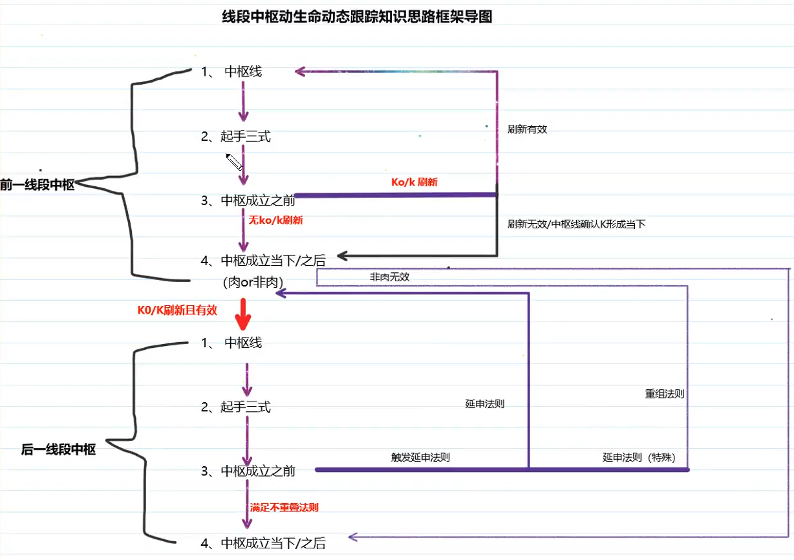
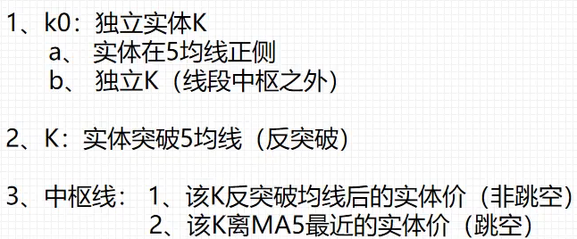
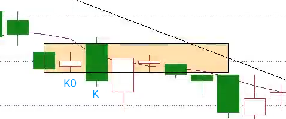

# 线段中枢

## 中枢线

### 中枢线的确认 K 线

- K0 (K 前边的一根 K 线), 为独立实体 K(**缠论中不分阴阳线, 最多分实体或最高最低价, 上下影线不是实体的一部分**), 同时满足以下条件
  - 实体在 MA5 的正侧(实体在 MA5 的左侧)
  - 独立 K 线实体(线段中枢之外, 即最高最低价都不在线段中枢内, 即使最高价与线段中枢边界重叠, 也算在线段中枢之外)
- K: 实体突破 MA5 (如果最高价与 MA5 相同, 不算突破, 下跌时同理)
- 中枢线
  - K 突破 MA5 后的实体价(非跳空)
  - K 离 MA5 最近的实体价(跳空, 同时实体与 MA5 没接触, 注意是实体, 不包括上下影线)

