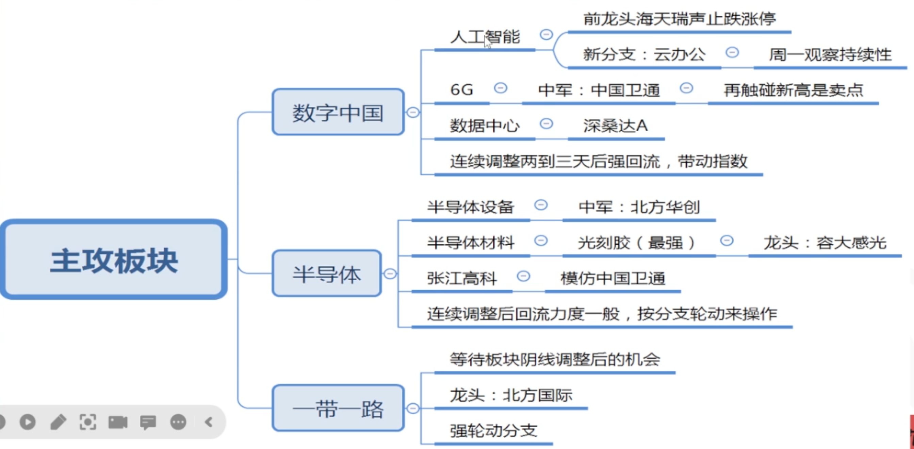
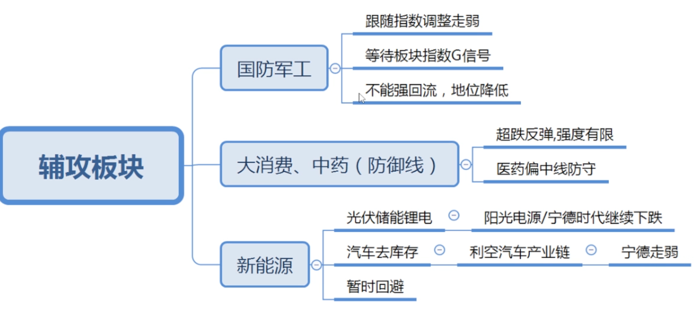

# 2023/03/20 TO 2023/03/24

## 2023/3/19

### 注意项

- 周一大概率会走调整
- 题材股低位震荡区, 等板块走阴线调整时(主力资金有小部分流出)再考虑选股入场, 等拉升时高抛
- 重点留意光刻胶
- 一带一路等回调再入场

### 持有股票

| 股票     | GS     | 主要概念     | 备注          |
| -------- | ------ | ------------ | ------------- |
| 晶方科技 | G 区间 | 光刻胶, 芯片 |               |
| 电科网安 | G 区间 | 芯片         |               |
| 盘龙药业 | G 区间 | 中药         | 出现S信号退场 |

### 周一入场股票

| 股票     | GS     | 主要概念                    | 备注       |
| -------- | ------ | --------------------------- | ---------- |
| 元隆雅图 | G 区间 | AI, ChatGPT                 | G 信号 2天 |
| 神州数码 | G 信号 | ChatGPT, 华为概念, 东数西算 | 挂涨停价   |

### 观察GS信号

| 股票     | GS     | 主要概念 | 备注            |
| -------- | ------ | -------- | --------------- |
| 海量数据 | S 区间 | 华为概念 | 出现 G 信号入场 |
| 吉宏股份 | G 信号 | AIGC概念 | 观察, 考虑入场  |

### 一带一路

| 股票     | GS     | 主要概念       | 备注                          |
| -------- | ------ | -------------- | ----------------------------- |
| 苏美达   | S 区间 | 光伏, 一带一路 | 已有暗盘资金, 出现 G 信号入场 |
| 中铁工业 | G 区间 | 一带一路       | 考虑回调入场                  |
| 中油资本 | G 区间 | 一带一路       | 考虑回调入场                  |

### 半导体

| 股票     | GS     | 主要概念 | 备注 |
| -------- | ------ | -------- | ---- |
| 北方华创 | G 区间 | 半导体   |      |
| 张江高科 | G 区间 | 光刻胶   |      |

## 2023/3/20

